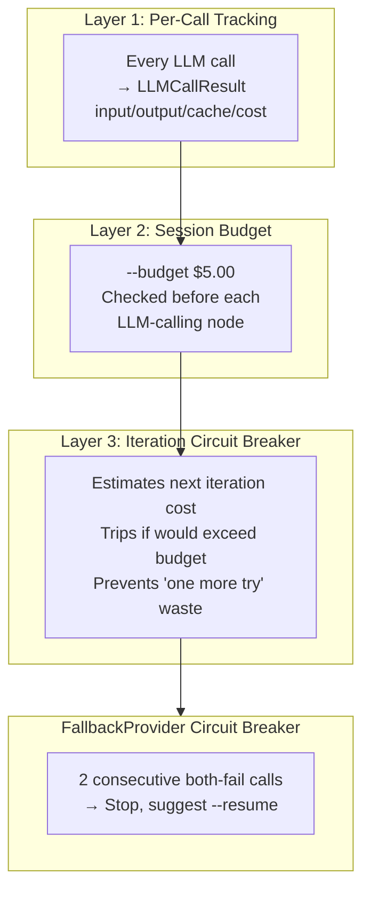

# Cost Management

> *"The reason that the rich were so rich, Vimes reasoned, was because they managed to spend less money. Take boots, for example."*
> — Terry Pratchett, *Men at Arms*

Sam Vimes' Boots Theory of Socioeconomic Unfairness applies directly to LLM cost management: spending more on instrumentation *saves* money by preventing runaway token consumption. A $5 budget guard prevents a $50 overnight disaster.

---

## Three-Layer Cost Control

AssemblyZero implements cost control at three escalating levels. Each layer catches what the previous one misses.



---

## Layer 1: Per-Call Tracking

Every LLM call returns an `LLMCallResult` with full cost observability:

```python
@dataclass
class LLMCallResult:
    success: bool
    provider: str          # "claude", "gemini", "anthropic"
    model_used: str
    duration_ms: int
    input_tokens: int      # Prompt tokens consumed
    output_tokens: int     # Completion tokens generated
    cache_read_tokens: int       # Prompt cache hits (10% of input price)
    cache_creation_tokens: int   # Prompt cache writes (125% of input price)
    cost_usd: float        # Calculated cost for this call
    rate_limited: bool     # True if 429 was encountered
```

Every call is logged with a structured line:

```
[LLM] provider=claude model=opus input=1024 output=512 cache_read=256 cost=$0.0234 cumulative=$5.12 duration=2.3s
```

The `cumulative` field provides running session cost visibility without needing a dashboard.

---

## Layer 2: Session-Level Budget

The `--budget` CLI flag sets a hard dollar limit per workflow run:

```bash
poetry run python tools/run_implement_from_lld.py \
    --issue 477 --repo /c/Users/mcwiz/Projects/Aletheia \
    --budget 5.00   # Default: $5.00 USD, 0=unlimited
```

| Flag | Default | Purpose |
|------|---------|---------|
| `--budget` | `$5.00` | Max API cost in USD before halting |
| `--token-budget` | `0` (unlimited) | Max estimated tokens before circuit breaker trips |

When cumulative cost exceeds the budget, the workflow halts with a clear message rather than silently burning through API credits.

---

## Layer 3: Iteration Circuit Breaker

The most sophisticated layer. Before each TDD iteration, the circuit breaker **estimates** what the next iteration will cost and trips if it would exceed the budget.

### Cost Estimation Model

```
Estimated tokens per iteration =
    BASE_OVERHEAD (5,000 tokens)
  + LLD content (chars / 4)
  + Completed files (accumulated context, chars / 4)
  + Context files (--context flag, chars / 4)
  + Test output feedback (chars / 4)
  + Output estimate (30% of input tokens)
```

| Constant | Value | Rationale |
|----------|-------|-----------|
| `CHARS_PER_TOKEN` | 4 | Rough conversion (industry standard) |
| `BASE_TOKENS_PER_ITERATION` | 5,000 | Overhead per iteration (system prompt, routing) |
| Output estimate | 30% of input | LLM outputs are typically shorter than inputs |
| Safety buffer | 1.2x | 20% pessimistic buffer for tokenizer mismatch |

### Trip Decision

```
If estimated_used + next_iteration_cost > token_budget:
    → TRIP: "[CIRCUIT] Token budget would be exceeded:
             490,000 used + 15,000 next = 505,000 > 500,000 budget"
```

The circuit breaker prevents the "one more try" trap — where a failing workflow keeps attempting iterations that each burn 15,000+ tokens with no improvement.

### Budget Summary

At workflow completion, `budget_summary()` generates a markdown report:

```markdown
## Token Budget Summary

| Metric | Value |
|--------|-------|
| Estimated tokens used | 200,000 |
| Token budget | 500,000 |
| Budget used | 40.0% |
```

This is saved to the audit trail as `NNN-token-budget.md` for post-mortem analysis.

---

## Provider Pricing

### Anthropic API (Claude)

| Model | Input (per M tokens) | Output (per M tokens) |
|-------|---------------------|----------------------|
| `claude-opus-4-6` | $5.00 | $25.00 |
| `claude-sonnet-4-6` | $3.00 | $15.00 |
| `claude-haiku-4-5` | $1.00 | $5.00 |

**Cache pricing adjustments:**
- Cache *read* tokens: **10%** of input price (massive savings on repeated context)
- Cache *creation* tokens: **125%** of input price (one-time overhead)

### Gemini (Review Layer)

Gemini reviews are metered separately through `gemini_client.py` with credential rotation across API keys. Flash/Lite models are **forbidden** — only Pro-tier models are permitted for reviews (fail-closed, not fail-cheap).

---

## Claude Max Quota Awareness

The Claude Max subscription imposes a rolling 5-hour usage window. When exhausted, the CLI returns specific error patterns that must be detected and handled as **non-retryable** to prevent token waste.

### Detection

`assemblyzero/core/errors.py` classifies these CLI stderr patterns as billing errors:

| Pattern | Meaning |
|---------|---------|
| `"usage limit"` | General quota exhaustion |
| `"usage has been exhausted"` | Max subscription window hit |
| `"wait until"` | Cooldown period active |

These patterns are checked by `is_non_retryable_error()` before any retry logic fires.

### Flow

```
CLI call → stderr contains "usage has been exhausted"
  → is_non_retryable_error() returns True
  → LLMCallResult.retryable = False
  → FallbackProvider trips circuit breaker
  → Workflow halts with "[NON-RETRYABLE]" prefix
```

### Implementation Node (N4) Integration

In the implementation workflow, `call_claude_for_file()` (Issue #546) classifies SDK errors through `classify_anthropic_error()`. Non-retryable errors skip the retry loop entirely and raise `ImplementationError`, preventing wasted API calls against a quota that won't recover within the retry window.

### Cost Optimization Stack (Issues #643, #625, #647)

The implementation node uses three layers of cost optimization:

1. **Stable system prompt** (#643): LLD, repo structure, tests, and context are built once as a system prompt, identical across all files. Per-file user messages contain only file-specific content.

2. **Prompt caching** (#625): The system prompt is sent as a structured block with `cache_control: {"type": "ephemeral"}`. First file pays 125% (cache creation), files 2+ pay 10% (cache read). Log line: `[CACHE] read=N create=N`.

3. **Batch generation** (#647): Small Haiku-routed files are grouped into batches of up to 5, reducing API calls. Failed batches fall back to individual generation.

---

## FallbackProvider Economics

The `FallbackProvider` wraps two providers in a cost-optimized failover:

```
Primary:   Claude CLI (free via Max subscription, 180s timeout)
Secondary: Anthropic API (paid, full timeout)
```

| Scenario | Cost | Action |
|----------|------|--------|
| CLI succeeds | $0.00 | Use response |
| CLI fails/times out | API price | Fall back to Anthropic API |
| Both fail once | $0.00 + API price | Log warning, continue |
| Both fail twice consecutively | N/A | **Circuit breaker trips** — suggests `--resume` |

The circuit breaker trips after **2 consecutive both-fail calls**. This prevents burning money on a failing API when the problem is likely infrastructure (rate limits, outages). The message:

```
[CIRCUIT BREAKER] 2 consecutive failures. Use --resume after API recovers.
```

---

## Cost Control in Practice

### A Typical Implementation Run

```
Iteration 1: 15,000 tokens (~$0.12)   → 3/25 tests passing
Iteration 2: 18,000 tokens (~$0.15)   → 15/25 tests passing
Iteration 3: 20,000 tokens (~$0.17)   → 25/25 tests passing ✓
Total: 53,000 tokens (~$0.44) — well under $5.00 budget
```

### A Failing Run (Without Cost Control)

```
Iteration 1:  15,000 tokens  → 3/25 passing
Iteration 2:  18,000 tokens  → 3/25 passing (stagnant!)
Iteration 3:  20,000 tokens  → 3/25 passing (still stagnant)
...
Iteration 10: 25,000 tokens  → 3/25 passing
Total: 200,000+ tokens (~$2.50+) — all wasted
```

### The Same Failing Run (With Cost Control)

```
Iteration 1: 15,000 tokens → 3/25 passing
Iteration 2: 18,000 tokens → 3/25 passing
→ STAGNATION DETECTED: same pass count, halting
→ Total: 33,000 tokens (~$0.27) — 85% savings
```

Stagnation detection (see [Observability & Monitoring](Observability-and-Monitoring#stagnation-detection)) and the circuit breaker work together: stagnation catches the "no progress" case, the circuit breaker catches the "too expensive" case.

---

## Related

- [Observability & Monitoring](Observability-and-Monitoring) — Structured logging and stagnation detection
- [Safety & Guardrails](Safety-and-Guardrails) — Kill switches and cascade prevention
- [Metrics Dashboard](Metrics) — Production cost numbers

---

*Captain Vimes had once remarked that, in the long run, a pair of good boots was cheaper than a lifetime of bad ones. In the long run, a $5 budget guard is cheaper than a $50 overnight disaster.*

**GNU Terry Pratchett**
