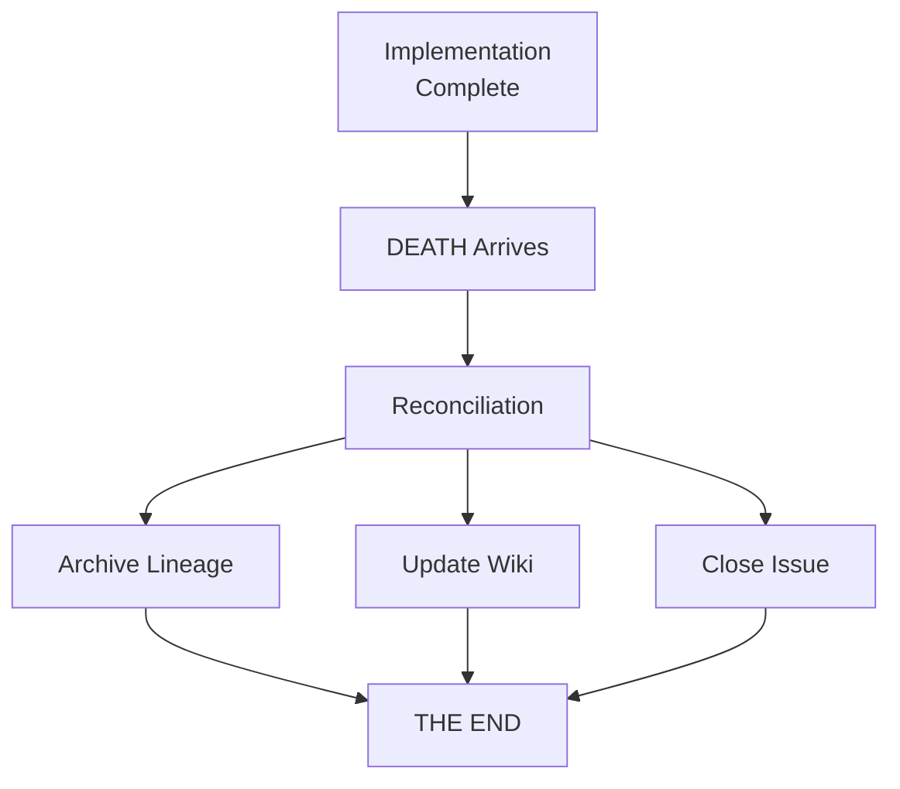

# DEATH

> THERE IS NO JUSTICE. THERE IS JUST ME.

---

```
              ___
             /   \
            | o o |
            |  >  |
             \___/
              |||
         ____|||____
        /           \
       /             \
      |   ☠️ DEATH ☠️  |
       \             /
        \___________/
            |   |
           _|   |_
          |_     _|
            |   |
            |   |
           /     \
          /       \
```

---

## The Character

DEATH is the Discworld's anthropomorphic personification of mortality. He rides a pale horse named Binky (he's tried skeletal horses, but they're not practical). He has a granddaughter named Susan. He SPEAKS ENTIRELY IN CAPITAL LETTERS.

DEATH is not evil. He's not even unkind. He's simply... inevitable.

> WHAT CAN THE HARVEST HOPE FOR, IF NOT FOR THE CARE OF THE REAPER MAN?

---

## The Function: Documentation Reconciliation

In AssemblyZero, DEATH arrives after implementation is complete. He has one job: **ensure nothing is forgotten**.



---

## DEATH's Checklist

After every implementation, DEATH verifies:

- [ ] Lineage moved to `archived/`
- [ ] LLD moved to `done/`
- [ ] Reports moved to `done/`
- [ ] Wiki updated (if architectural change)
- [ ] Issue marked closed
- [ ] Branch deleted
- [ ] Worktree removed

IF ANY ITEM REMAINS UNCHECKED, DEATH WAITS.

---

## The Duty

DEATH doesn't enjoy his job. But he does it. Because someone must.

> I COULD BE BOUNDED IN A NUTSHELL AND COUNT MYSELF A KING OF INFINITE SPACE, WERE IT NOT THAT I HAVE BAD DREAMS.

In AssemblyZero, the "bad dreams" are:
- Orphaned worktrees
- Stale branches
- Unclosed issues
- Forgotten lineage

DEATH ensures these dreams don't come true.

---

## The Binky Module

```python
class Binky:
    """DEATH's horse. Always ready, never tired."""

    def __init__(self):
        self.color = "pale"
        self.speed = float('inf')  # Can be anywhere instantly
        self.oats = "quantum"  # Exists and doesn't exist

    def ride_to(self, destination):
        # Binky doesn't travel. He's simply THERE.
        return destination
```

---

## Susan

DEATH's granddaughter, Susan Sto Helit, inherited some of his abilities. She can walk through walls, become invisible when she doesn't want to be noticed, and see things that aren't entirely there.

In AssemblyZero, "Susan mode" is debug mode—seeing the invisible threads that connect the system:

```bash
assemblyzero debug --susan
# Reveals:
# - Hidden state
# - Pending reconciliations
# - Orphaned resources
# - The things that shouldn't exist but do
```

---

## The Hourglass

Every person has an hourglass showing their remaining time. DEATH keeps them in his domain.

Every issue has an hourglass too:

```
Issue #123
├── Created: 2026-02-02 10:30
├── LLD Approved: 2026-02-02 14:15
├── Implementation: 2026-02-02 18:45
├── PR Merged: 2026-02-02 20:30
└── DEATH Arrived: 2026-02-02 20:31
    └── Reconciliation complete. THE END.
```

---

## The Philosophy

> LORD, WHAT CAN THE HARVEST HOPE FOR, IF NOT FOR THE CARE OF THE REAPER MAN?

Code that lives forever becomes legacy. Features that never end become debt. Issues that never close become haunting.

DEATH is not the enemy. DEATH is the friend who ensures things end properly, so new things can begin.

---

## Albert

DEATH's manservant, Albert, was once Alberto Malich, founder of Unseen University. He cheated death by hiding in DEATH's domain, where time doesn't pass normally.

In AssemblyZero, "Albert mode" is archive mode—things don't change, they're just... preserved:

```
docs/lineage/archived/
├── 123-feature/  # Albert watches over these
├── 124-bugfix/   # They don't change
└── 125-refactor/ # They're just... preserved
```

---

## The Words

DEATH has delivered many memorable lines:

> HUMANS NEED FANTASY TO BE HUMAN.

> THE SUN WOULD NOT RISE TOMORROW IF THERE WASN'T SOMEONE WHO BELIEVED IT WOULD.

> I MEANT METAPHORICALLY.

> NO, YOU MEANT LITERALLY. YOU JUST DON'T KNOW WHAT LITERALLY MEANS.

---

## Invocation

To summon DEATH in AssemblyZero:

```bash
# After merge, DEATH arrives automatically
gh pr merge 123 --squash --delete-branch

# Or invoke manually
python tools/death.py reconcile --issue 123
```

DEATH always comes. The only question is whether you're ready.

---

*"No one is actually dead until the ripples they cause in the world die away..."*
— Reaper Man

---

*[Return to the living](Home) | [Visit the Hogfather](Hogswatch) | [Check the Clacks](The-Clacks)*
