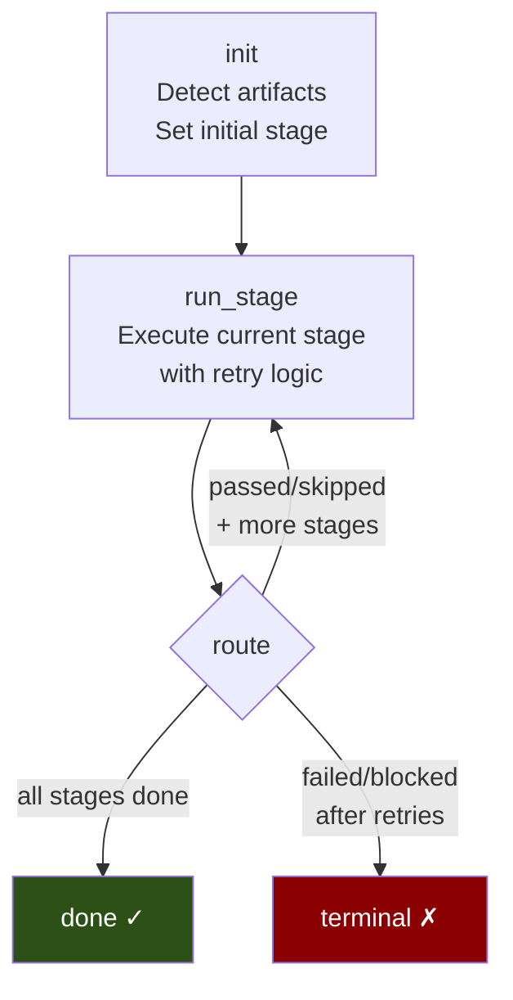
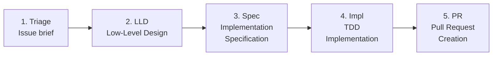
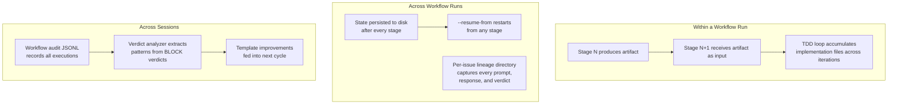
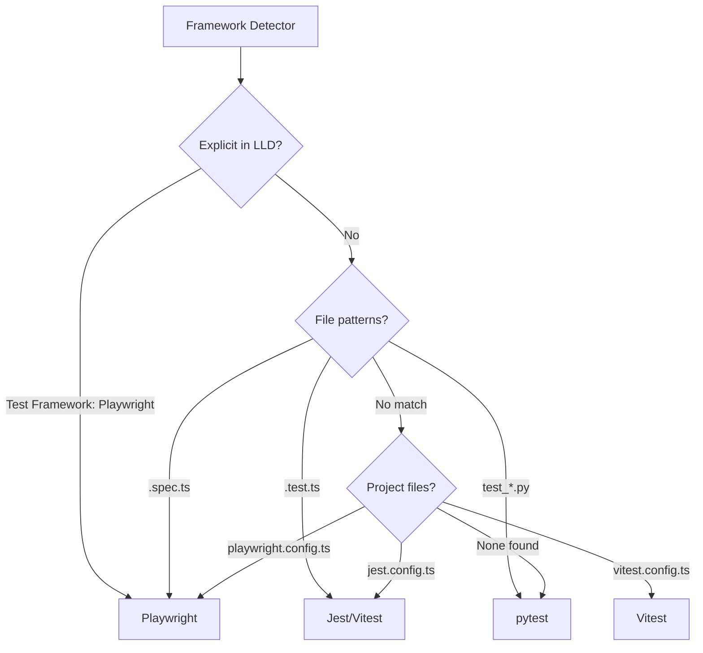

# End-to-End Orchestration

> *"The Clacks. It was a kind of miracle. Messages flew from one end of the continent to the other in seconds. And if a tower went down, the messages found another route. The whole thing was alive."*
> — Terry Pratchett, *Going Postal*

Moist von Lipwig kept the Clacks running — messages in, messages out, towers retried, state preserved. AssemblyZero's orchestration pipeline does the same for software development: issues in, PRs out, failures retried, state persisted.

---

## Pipeline Architecture

The orchestrator is a LangGraph `StateGraph` with four nodes and a routing function:



| Node | Purpose |
|------|---------|
| `init` | Detects existing artifacts, determines starting stage, acquires file lock |
| `run_stage` | Executes the current stage with retry logic (up to 3 attempts) |
| `route` | Examines stage result → advance, retry, or terminate |
| `done` | Terminal success state — all stages completed |
| `terminal` | Terminal failure state — unrecoverable error or human gate block |

---

## Five Stages



| Stage | Input | Output | Artifact |
|-------|-------|--------|----------|
| **Triage** | GitHub issue | Issue brief | `docs/lineage/{issue}/issue-brief.md` |
| **LLD** | Issue brief | Low-Level Design | `docs/lld/active/LLD-{issue}.md` |
| **Spec** | LLD | Implementation specification | `docs/lineage/{issue}/impl-spec.md` |
| **Impl** | Spec + LLD | Passing code + tests | Worktree at `../AssemblyZero-{issue}` |
| **PR** | Worktree | Pull request | GitHub PR URL |

Each stage has a dedicated runner function and produces a typed artifact. Stages are ordered — you can't implement before designing, and you can't PR before implementing.

---

## State Management

The `OrchestrationState` captures the full pipeline state:

```python
class OrchestrationState(TypedDict):
    # Identity
    issue_number: int
    current_stage: str       # "triage" | "lld" | "spec" | "impl" | "pr" | "done"

    # Artifacts (populated as stages complete)
    issue_brief_path: str
    lld_path: str
    spec_path: str
    worktree_path: str
    pr_url: str

    # Progress tracking
    stage_results: dict[str, StageResult]   # Per-stage outcomes
    stage_attempts: dict[str, int]          # Attempt counts

    # Timing (ISO8601)
    started_at: str
    stage_started_at: str
    completed_at: str

    # Configuration snapshot
    config: OrchestratorConfig

    # Error state
    error_message: str
```

Each `StageResult` records:

```python
class StageResult(TypedDict):
    status: str              # "passed" | "blocked" | "failed" | "skipped"
    artifact_path: str       # Path to produced artifact
    error_message: str       # If failed/blocked
    duration_seconds: float  # Wall-clock time
    attempts: int            # How many tries
```

---

## Context Flow & Memory

The pipeline manages context at three timescales:



### Within a Run: Artifact Passing

Each stage produces a typed artifact that feeds the next:
- **Triage** produces `issue_brief_path` → consumed by **LLD** as context
- **LLD** produces `lld_path` → injected into every **TDD iteration** as the design anchor
- **Spec** produces `spec_path` → consumed by **Impl** for implementation guidance
- **Impl** accumulates test output + implementation files across iterations — each iteration sees what the model already built

The TDD loop is especially context-rich: the full LLD, all completed files, test output from the previous iteration, and any `--context` files are injected every iteration. This prevents the model from "forgetting" what it already implemented.

### Across Runs: Persistent State

State snapshots at `.assemblyzero/orchestrator/state/{issue}.json` survive process crashes. Per-issue lineage directories (`docs/lineage/active/{issue}-testing/`) capture sequentially numbered files — every prompt sent, every response received, every verdict issued. This provides full reconstructability for post-mortems.

### Across Sessions: Learning Loop

The verdict analyzer scans historical Gemini BLOCK verdicts, extracts recurring patterns, and recommends template additions. 164 verdicts analyzed → 6 template sections added. The system's prompts literally improve from its own review feedback. See [How AssemblyZero Learns](How-AssemblyZero-Learns).

---

## Resumability

State is persisted to disk after every stage completion:

```
.assemblyzero/orchestrator/state/{issue_number}.json
```

### Resume Scenarios

| Scenario | Command | Behavior |
|----------|---------|----------|
| Process crashed at impl | `orchestrate --issue 477 --resume-from impl` | Loads state, skips triage/lld/spec |
| API outage during LLD | `orchestrate --issue 477` | Auto-resumes from last completed stage |
| Want to re-run spec | `orchestrate --issue 477 --resume-from spec` | Resets to spec, re-runs spec → impl → pr |

### Resume Logic

```python
def determine_resume_stage(state, resume_from: str | None) -> str:
    if resume_from is None:
        return state.get("current_stage", "triage")  # Auto-detect
    if resume_from not in STAGE_ORDER:
        raise ValueError(f"Invalid stage: {resume_from}")
    return resume_from
```

State files are backed up (`.json.bak`) before overwriting — belt and suspenders.

---

## Human Gates

Each stage can optionally block for human approval:

```python
gates = {
    "triage": False,    # Auto-proceed
    "lld": False,       # Auto-proceed
    "spec": False,      # Auto-proceed
    "impl": False,      # Auto-proceed
    "pr": True,         # HUMAN GATE — blocks by default
}
```

The PR stage has a human gate **enabled by default** — the pipeline produces the PR but waits for a human to approve before creating it. Override with `--no-gate-pr` for full automation.

When a gate blocks, the stage result records `status: "blocked"` and the pipeline terminates with the gate state preserved. Resume after review to continue.

---

## Retry Logic

Each stage retries up to `max_stage_retries` (default: 3) with a configurable delay:

```
Stage: impl
  Attempt 1: FAILED (test timeout)
  [sleep 10s]
  Attempt 2: FAILED (syntax error in generation)
  [sleep 10s]
  Attempt 3: PASSED (25/25 tests green) ✓
```

| Config | Default | Purpose |
|--------|---------|---------|
| `max_stage_retries` | 3 | Maximum attempts per stage |
| `retry_delay_seconds` | 10 | Pause between retries (rate limit courtesy) |

State is saved after each attempt — if the process dies mid-retry, it resumes from the last completed attempt.

Retry is **not** applied to blocked stages (human gates) — those require human action, not repetition.

---

## Concurrency Safety

File-based locking prevents multiple orchestrator runs on the same issue:

```
.assemblyzero/orchestrator/locks/477.lock
{
  "pid": 12345,
  "started_at": "2026-02-26T15:00:00Z",
  "hostname": "WORKSTATION"
}
```

| Feature | Implementation |
|---------|---------------|
| **Lock acquisition** | Write PID + timestamp to lock file |
| **Conflict detection** | Check if existing lock's PID is alive (`os.kill(pid, 0)`) |
| **Stale lock cleanup** | Dead process → remove lock automatically |
| **Lock release** | `unlink(missing_ok=True)` on completion or error |

Different issues can run concurrently (different lock files). Same issue cannot.

---

## Stage Skip Logic

The `init` node scans for existing artifacts and skips completed stages:

| Stage | Artifact Checked | Skip Allowed? |
|-------|-----------------|---------------|
| Triage | `docs/lineage/{issue}/issue-brief.md` | Yes |
| LLD | `docs/lld/active/LLD-{issue}.md` | Yes |
| Spec | `docs/lineage/{issue}/impl-spec.md` | Yes |
| Impl | Worktree at `../AssemblyZero-{issue}` | **Never** — always re-runs |
| PR | (not detectable) | **Never** — always re-runs |

Artifact validation is structural, not just existence:
- LLD must contain `## 1. Context`
- Spec must contain `## 1. Overview`
- Triage brief must contain at least one `## ` heading
- Files must be non-empty

This prevents skipping a stage because a corrupted or empty artifact happens to exist at the expected path.

---

## Multi-Framework Test Support

The TDD implementation stage auto-detects the appropriate test framework:



### Supported Frameworks

| Framework | Runner Command | Coverage Type | File Pattern |
|-----------|---------------|---------------|-------------|
| **pytest** | `pytest` | Line-based | `test_*.py` |
| **Playwright** | `npx playwright test` | Scenario-based | `*.spec.ts` |
| **Jest** | `npx jest` | Line-based | `*.test.ts` |
| **Vitest** | `npx vitest` | Line-based | `*.test.ts` |

### Unified Result Type

All frameworks produce a `TestRunResult`:

```python
class TestRunResult(TypedDict):
    passed: int
    failed: int
    skipped: int
    errors: int
    total: int
    coverage_percent: float
    coverage_type: CoverageType    # LINE | SCENARIO | NONE
    raw_output: str
    exit_code: int
    framework: TestFramework       # PYTEST | PLAYWRIGHT | JEST | VITEST
```

Playwright uses **scenario-based coverage** (`passed / total_scenarios`) rather than line coverage — because E2E tests measure user journeys, not code paths.

---

## Test Suite

The orchestration system is backed by **3,386 tests** across 134 test files:

| Category | Files | Scope |
|----------|-------|-------|
| Unit tests | 105 | Individual functions, edge cases, error paths |
| Integration tests | 4 | Cross-module workflows |
| E2E, benchmark, compliance, etc. | 25 | Full pipeline validation |

Key test areas: orchestrator state, stage execution, artifact detection, framework detection, runner registry, exit code routing, circuit breaker, completeness gate, scaffold generation, and more.

---

## Configuration

Full orchestrator configuration with defaults:

```python
{
    "skip_existing_lld": True,
    "skip_existing_spec": True,
    "stages": {
        "triage": {"drafter": "claude:opus-4.5", "timeout_seconds": 300},
        "lld":    {"drafter": "claude:opus-4.5", "timeout_seconds": 600},
        "spec":   {"drafter": "claude:opus-4.5", "timeout_seconds": 600},
        "impl":   {"drafter": "claude:opus-4.5", "timeout_seconds": 1800},
        "pr":     {"drafter": "",                 "timeout_seconds": 120},
    },
    "gates": {
        "triage": False, "lld": False, "spec": False,
        "impl": False,   "pr": True,
    },
    "max_stage_retries": 3,
    "retry_delay_seconds": 10,
}
```

Every configuration value can be overridden via CLI flags or config file.

---

## Related

- [The Pipeline](The-Pipeline) — Earlier pipeline documentation
- [Observability & Monitoring](Observability-and-Monitoring) — Telemetry from the pipeline
- [Cost Management](Cost-Management) — Budget controls during execution
- [Safety & Guardrails](Safety-and-Guardrails) — Gates and kill switches
- [LangGraph Evolution](LangGraph-Evolution) — Architecture background

---

*Moist looked at the Clacks tower. Messages went up. Messages came down. Some towers failed. The messages found another way. The system lived because it was designed to survive its own failures.*

*AssemblyZero's pipeline works the same way. Stages fail. Retries happen. State persists. The pipeline finds another way.*

**GNU Terry Pratchett**
