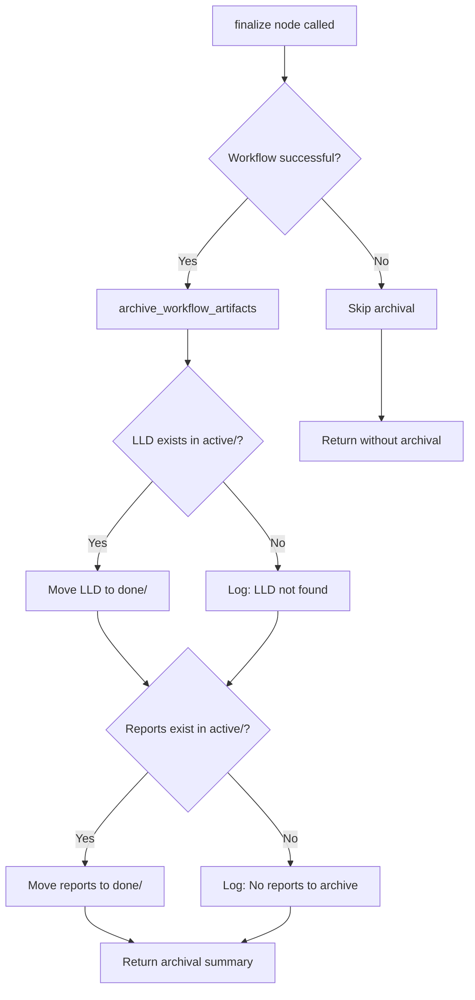

# Fix: Implementation Workflow Should Archive LLD and Reports to done/ on Completion

> Generated from [Issue #141](../issues/141)

---

## Overview

* **Issue:** #141
* **Objective:** Automatically archive LLD and report files from `active/` to `done/` directories when the implementation workflow completes successfully.
* **Status:** Draft
* **Related Issues:** #139 (Rename workflows/testing/ to workflows/implementation/), #140 (Inhume deprecated workflows)

### Open Questions

- [x] Should archival happen on any completion or only on success? → Only on success (failed workflows may need rework)
- [x] What happens if `done/` directory doesn't exist? → Create it automatically
- [x] Should we handle the case where LLD doesn't exist (manual implementations)? → Yes, gracefully skip with log message

---

## Architecture

---

## Key Features

- for implementation. Describe exactly what will be built.*
- **Module:** `assemblyzero/workflows/testing/nodes/finalize.py`
- **Pattern:** Helper function extraction for testability
- Gracefully handle missing files (don't fail workflow)
- - Must integrate with existing finalize node structure
- Cannot introduce breaking changes to workflow state
- Must work with #139 rename (path-agnostic implementation)

---

## Related

- [Issue #141](../issues/141)
- [LLD](../docs/lld/active/LLD-141.md)
