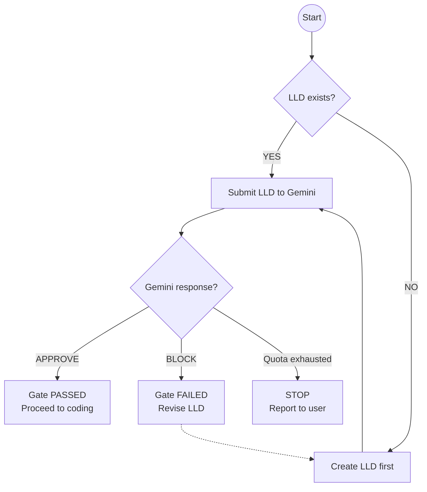
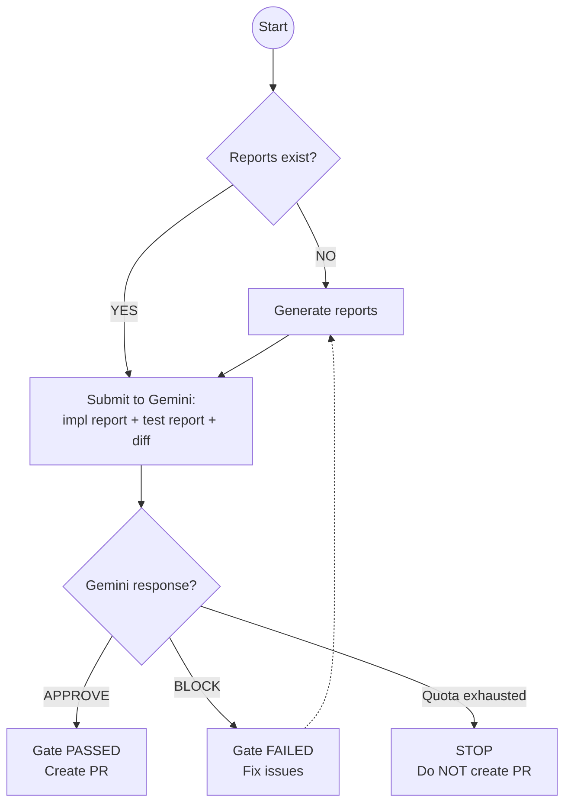

# Governance Gates

> Enforced checkpoints that satisfy security teams and improve code quality

---

## Overview

AssemblyZero implements three mandatory governance gates:

| Gate | When | What | Why |
|------|------|------|-----|
| **LLD Review** | Before coding | Gemini reviews design | Catch design issues early |
| **Implementation Review** | Before PR | Gemini reviews code | Catch quality issues |
| **Report Generation** | Before merge | Auto-generate docs | Audit trail |

These gates are **enforced**, not suggested. The workflow cannot proceed without passing.

---

## LLD Review Gate

### Purpose

Catch design problems before they become code problems.

**Cost of design fix:** 1 hour
**Cost of code fix:** 8 hours
**Cost of production fix:** 80 hours

### Trigger

Before writing ANY code for an issue:



### LLD Location

```
docs/LLDs/active/{issue-id}-{description}.md   # During development
docs/LLDs/done/{issue-id}-{description}.md     # After merge
```

### LLD Content Requirements

Minimum sections:

```markdown
# Low-Level Design: {Feature Name}

## 1. Overview
What this feature does and why.

## 2. Requirements
Functional and non-functional requirements.

## 3. Design
### 3.1 Data Model
### 3.2 API/Interface
### 3.3 Implementation Approach

## 4. Error Handling
How failure modes are handled.

## 5. Security Considerations
Authentication, authorization, data protection.

## 6. Testing Strategy
How this will be tested.
```

### Review Criteria

Gemini evaluates:

| Criterion | Question |
|-----------|----------|
| **Completeness** | All requirements addressed? |
| **Error Handling** | Failure modes covered? |
| **Security** | Auth, authz, data protection considered? |
| **API Contract** | Inputs, outputs, errors specified? |
| **Data Flow** | How data moves through system clear? |
| **Testability** | Can this be tested? |

### Response Format

```json
{
  "verdict": "APPROVE" | "BLOCK",
  "summary": "Overall assessment",
  "issues": [
    {
      "severity": "critical" | "major" | "minor",
      "category": "security | completeness | clarity",
      "description": "What's wrong",
      "recommendation": "How to fix"
    }
  ]
}
```

### Approval Rates

| Outcome | Rate | Action |
|---------|------|--------|
| First-pass APPROVE | 65-75% | Proceed |
| After 1 revision | 90%+ | Proceed |
| After 2+ revisions | 99%+ | Proceed |

---

## Implementation Review Gate

### Purpose

Catch code quality issues before human review.

### Trigger

After coding is complete, before PR creation:



### Report Locations

```
docs/reports/active/{issue-id}-implementation-report.md   # During development
docs/reports/active/{issue-id}-test-report.md             # During development
docs/reports/done/{issue-id}-implementation-report.md     # After merge
docs/reports/done/{issue-id}-test-report.md               # After merge
```

### Implementation Report Content

```markdown
# Implementation Report: {Feature Name}

## Issue Reference
[#{issue-id}]({link})

## Files Changed
| File | Change Type | Description |
|------|-------------|-------------|
| src/feature.py | Added | Main implementation |
| tests/test_feature.py | Added | Unit tests |

## Design Decisions
Why certain approaches were chosen.

## Known Limitations
What doesn't work or isn't complete.

## Testing
How the changes were tested.
```

### Test Report Content

```markdown
# Test Report: {Feature Name}

## Test Command
```
pytest tests/test_feature.py -v
```

## Full Output
```
[COMPLETE test output - not paraphrased]
```

## Coverage
| File | Lines | Coverage |
|------|-------|----------|
| src/feature.py | 120 | 87% |

## Skipped Tests
| Test | Reason |
|------|--------|
| test_edge_case | Pending API mock |
```

### Review Criteria

Gemini evaluates:

| Criterion | Question |
|-----------|----------|
| **Code Quality** | Readable, maintainable? |
| **Test Coverage** | Adequate for changes? |
| **Pattern Compliance** | Follows project conventions? |
| **Security** | No vulnerabilities? |
| **Documentation** | Updated for changes? |

### Approval Rates

| Outcome | Rate | Action |
|---------|------|--------|
| First-pass APPROVE | 75-85% | Create PR |
| After 1 revision | 95%+ | Create PR |
| After 2+ revisions | 99%+ | Create PR |

---

## Report Generation Gate

### Purpose

Create audit trail for all changes.

### Trigger

Before implementation review:

```
Step 1: Generate implementation-report.md
Step 2: Run tests
Step 3: Generate test-report.md
Step 4: Proceed to Implementation Review Gate
```

### Auto-Generation

Claude generates reports automatically using templates:

```python
# Implementation report template
template = """
# Implementation Report: {title}

## Issue Reference
[#{issue_id}]({issue_url})

## Files Changed
{files_table}

## Design Decisions
{decisions}

## Known Limitations
{limitations}
"""
```

---

## Gate Enforcement

### Current: Prompt-Based

Gates are enforced through CLAUDE.md instructions:

```markdown
## LLD REVIEW GATE (BEFORE CODING)

Before writing ANY code for an issue, execute this gate:
1. Submit LLD to Gemini for review
2. If [APPROVE] → proceed to coding
3. If [BLOCK] → fix issues before coding

State the gate explicitly:
> "Executing LLD REVIEW GATE: Submitting LLD to Gemini before coding."
```

### Future: State Machine Enforcement

With LangGraph, gates become structurally impossible to skip:

```python
workflow.add_conditional_edges(
    "gemini_lld_review",
    route_by_verdict,
    {
        "implement": "implement",      # Only path forward
        "draft_lld": "draft_lld",      # Revision path
        "human_approval": "human"      # Escalation path
    }
)
# No edge exists to skip the review
```

See: [LangGraph Evolution](LangGraph-Evolution)

---

## Escape Hatches

### Hotfix Waiver

For [HOTFIX] tagged issues, user can explicitly waive LLD review:

```markdown
User: "This is a critical production fix, waive LLD review"
Agent: "Acknowledged. Waiving LLD review for HOTFIX. Proceeding to implementation."
```

The waiver is logged for audit.

### Human Override

If Gemini blocks with contested reasoning:

```markdown
User: "Override the block, I've reviewed the concerns"
Agent: "Acknowledged. Human override recorded. Proceeding."
```

Human judgment supersedes Gemini when explicitly invoked.

---

## Metrics

### Gate Performance

| Metric | Target | Warning |
|--------|--------|---------|
| LLD first-pass approval | 70%+ | < 50% |
| Implementation first-pass | 80%+ | < 60% |
| Average revisions | < 1.5 | > 2.5 |
| Gate time (LLD) | < 2 min | > 5 min |
| Gate time (Impl) | < 5 min | > 10 min |

### Common Block Reasons

Tracked to improve templates and training:

```
LLD Blocks (last 30 days):
├── Missing error handling: 35%
├── Incomplete API contract: 25%
├── Missing security section: 20%
├── Unclear data flow: 15%
└── Other: 5%

Implementation Blocks:
├── Missing test coverage: 40%
├── Security issue detected: 25%
├── Pattern violation: 20%
├── Missing docs update: 10%
└── Other: 5%
```

---

## Related Pages

- [Gemini Verification](Gemini-Verification) - Multi-model architecture
- [Measuring Productivity](Measuring-Productivity) - Gate metrics
- [LangGraph Evolution](LangGraph-Evolution) - State machine enforcement
- [Security Compliance](Security-Compliance) - Security audit details
