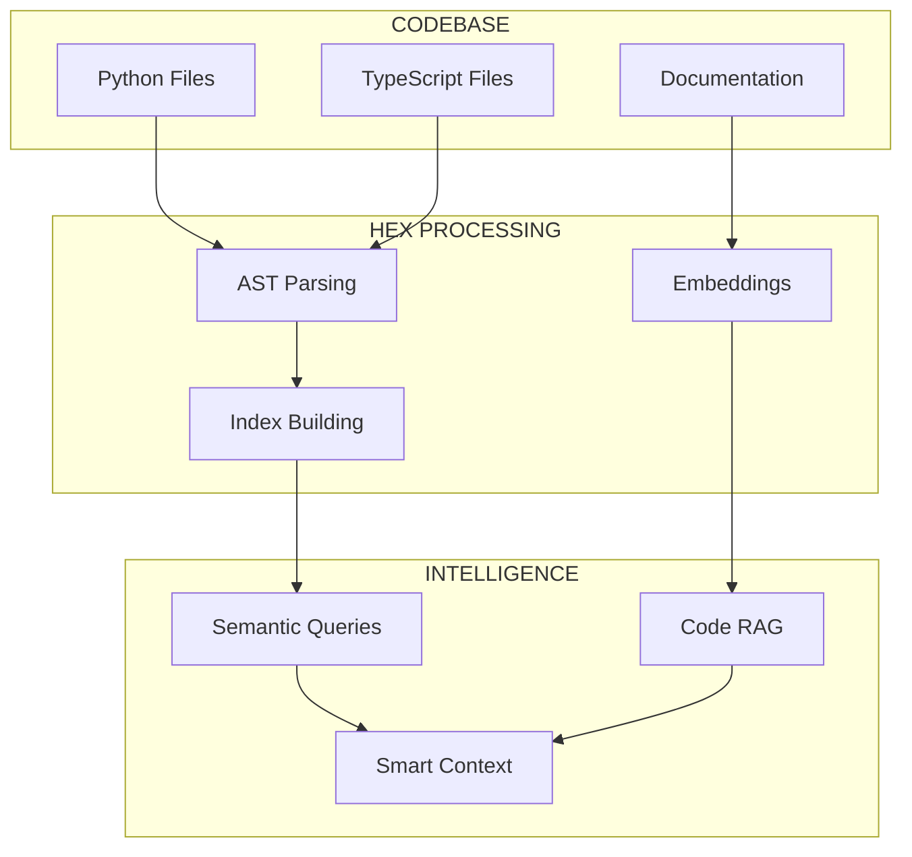
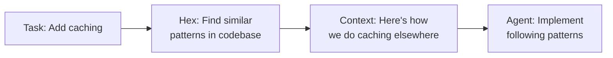

# Hex: Codebase Intelligence

> *"+++DIVIDE BY CUCUMBER ERROR. PLEASE REINSTALL UNIVERSE AND REBOOT+++"*

---

## The Character

**Source:** *Soul Music*, *Hogfather*, *The Science of Discworld*

Hex is Unseen University's thinking engine—a computer made of ants, beehives, an aquarium, glass tubes, and a teddy bear named Wuffles (for added capacity). It processes queries and returns answers, occasionally experiencing existential errors.

No one is quite sure how Hex works. Parts appear overnight that no one added. The ants seem to know what they're doing. It occasionally makes requests ("ANTHILL INSIDE" became standard equipment after Hex asked for it). When asked whether it's alive, it replied "+++UNSURE. ASK ME AGAIN LATER+++"

---

## The Function: Codebase Intelligence Layer

In AssemblyZero, Hex handles **codebase intelligence**—understanding the structure and semantics of code beyond simple text search.



---

## What Hex Provides

### 1. AST-Based Indexing

Unlike text search, Hex understands code structure:

```python
# Text search finds "authenticate" anywhere
grep -r "authenticate" .

# Hex finds the authenticate FUNCTION
hex.find_function("authenticate")
# Returns: src/auth/core.py:45 - def authenticate(user, token) -> bool

# Hex finds callers
hex.find_callers("authenticate")
# Returns: [src/api/login.py:23, src/api/refresh.py:12, ...]
```

### 2. Signature Extraction

```python
hex.get_signature("UserService")
# Returns:
# class UserService:
#     def create(self, email: str, password: str) -> User
#     def delete(self, user_id: int) -> bool
#     def find_by_email(self, email: str) -> Optional[User]
```

### 3. Dependency Mapping

```python
hex.get_dependencies("src/feature.py")
# Returns:
# imports:
#   - src.core.base: BaseClass
#   - src.utils.helpers: format_date, validate_email
# imported_by:
#   - src.api.endpoints: uses Feature
#   - tests.test_feature: tests Feature
```

### 4. Code RAG

When agents need context for implementation:

```python
hex.search("how does authentication work", top_k=5)
# Returns semantically relevant code snippets
# Not just keyword matches
```

---

## The Smart Engineer Pattern

Hex enables the "Smart Engineer" injection—giving agents the context a senior engineer would have:



Instead of inventing new patterns, agents follow existing conventions.

---

## Why Not Just Grep?

| Capability | Grep | Hex |
|------------|------|-----|
| Find text "authenticate" | Yes | Yes |
| Find function `authenticate()` | Partial | Yes |
| Find all callers | No | Yes |
| Understand inheritance | No | Yes |
| Semantic similarity | No | Yes |
| Cross-file relationships | Manual | Automatic |

---

## Integration with Workflows

### Requirements Workflow
- Find similar features already implemented
- Identify patterns to follow
- Detect potential conflicts with existing code

### Implementation Workflow
- Inject relevant code context
- Find tests to model new tests on
- Identify files affected by changes

### Code Review
- Check pattern compliance
- Find existing implementations of similar logic
- Detect inconsistencies with codebase style

---

## Implementation Status

| Component | Status |
|-----------|--------|
| Issue | [#92](https://github.com/martymcenroe/AssemblyZero/issues/92) |
| AST indexing | In design |
| Signature extraction | Planned |
| Code embeddings | Planned |
| RAG integration | Planned |

---

## Technical Architecture

```
hex/
├── parser/
│   ├── python_ast.py     # Python AST parsing
│   └── typescript_ast.py # TypeScript AST parsing
├── index/
│   ├── symbol_index.py   # Function/class index
│   ├── call_graph.py     # Who calls what
│   └── import_graph.py   # Dependency relationships
├── embeddings/
│   ├── code_embedder.py  # Code to vectors
│   └── doc_embedder.py   # Docs to vectors
└── query/
    ├── semantic.py       # Natural language queries
    └── structural.py     # AST-based queries
```

---

## The Wuffles Component

In the books, Hex requested a teddy bear for unexplained reasons. It improved performance.

In AssemblyZero Hex, "Wuffles" is the **comfort component**—small affordances that make the system work better for humans:

| Wuffles Feature | Purpose |
|-----------------|---------|
| Progress indicators | Know Hex is working |
| Readable output | Human-friendly results |
| Gentle error messages | Not just stack traces |
| "Did you mean?" suggestions | Typo recovery |

Sometimes you just need a teddy bear.

---

## Future: The Ants

Hex's ants represent **incremental background processing**:

- Index changes as files are modified
- Rebuild embeddings in spare cycles
- Detect when index is stale
- Self-repair corrupted indexes

The ants are always working, even when you're not looking.

---

## Related

- [Ponder Stibbons](Ponder-Stibbons) - Works with Hex on processing
- [The Librarian](Dramatis-Personae#the-librarian) - Documentation indexing
- [Brutha](Dramatis-Personae#brutha) - RAG memory layer
- [Multi-Agent Orchestration](Multi-Agent-Orchestration) - Where Hex fits

---

*"The University had a computer. It was called Hex.
No one knew how it worked, but it did.
That was the main thing."*
— Terry Pratchett
