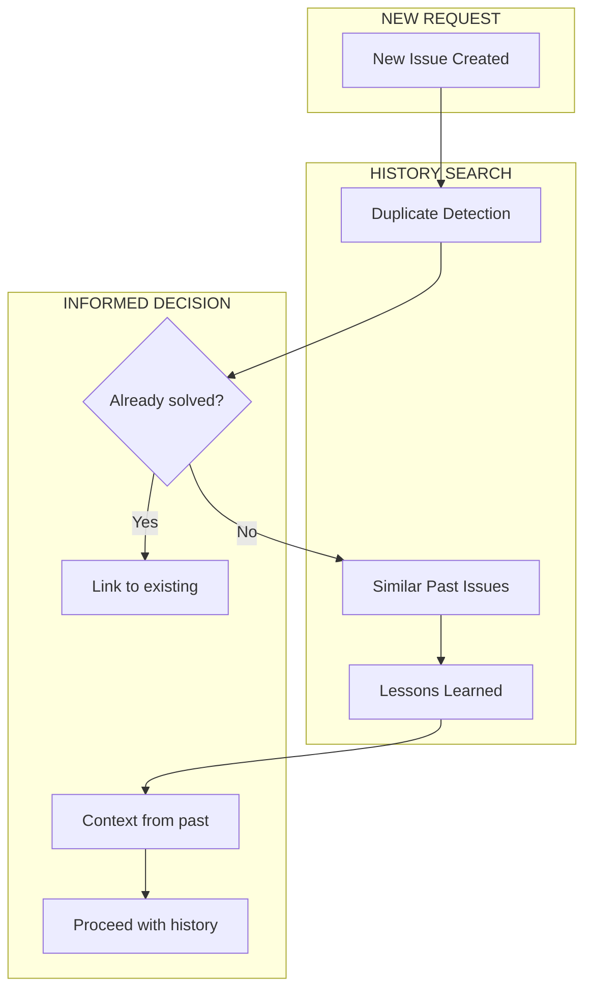
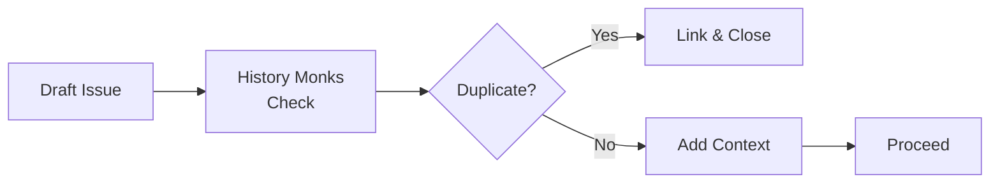
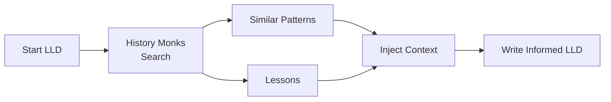

# The History Monks

> *"Remember: the future is another country; they do things the same there."*

---

## The Characters

**Source:** *Thief of Time*, *Small Gods*

The History Monks of Oi Dong monastery manage the flow of time itself. They store it in glass jars, move it between locations, repair it when it breaks, and ensure cause precedes effect.

Their greatest challenge was the Crash—when the Glass Clock of Bad Schüschein shattered time itself. The monks spent years picking up the pieces and putting history back together, mostly in the right order.

Lu-Tze, the sweeper, is their most accomplished member. He appears to be a simple janitor, but he's actually one of the most powerful beings on the Disc. Rule One: "Do not act incautiously when confronting little bald wrinkly smiling men."

---

## The Function: Historical Intelligence Layer

In AssemblyZero, The History Monks ensure we learn from the past before creating the future.



---

## What The History Monks Provide

### 1. Duplicate Issue Detection

Before creating a new issue:

```python
monks.find_duplicates("Add caching to API responses")
# Returns:
# - #45: "Cache API calls" (CLOSED - duplicate of #12)
# - #12: "Implement API caching layer" (CLOSED - merged)
# - #89: "Cache invalidation for API" (OPEN - related)
```

**Prevent:** Solving the same problem twice

### 2. Similar Past Solutions

When starting work:

```python
monks.find_similar("rate limiting middleware")
# Returns:
# - #67: Rate limiter implementation
#   - Solution: Token bucket algorithm
#   - Files: src/middleware/rate_limit.py
#   - Lessons: Redis-based was too slow, switched to in-memory
```

**Provide:** Context before reinventing

### 3. Lessons Learned Integration

```python
monks.get_lessons("authentication")
# Returns:
# - 2026-01-15: JWT refresh tokens need short expiry (#34)
# - 2026-01-20: Session storage must handle Redis failover (#41)
# - 2026-01-28: Password hashing: use bcrypt, not SHA256 (#52)
```

**Remember:** Past mistakes to avoid repeating

### 4. "Have We Solved This Before?"

```python
monks.have_we_solved("handle API timeouts gracefully")
# Answer: Yes, in #23
# Pattern: Exponential backoff with jitter
# Implementation: src/utils/retry.py
# Tests: tests/test_retry.py
```

**Shortcut:** Don't design what already exists

---

## The Time Jars Pattern

Monks store time in glass jars, redistributing it where needed. In AssemblyZero, we store **context** in structured formats:

| Jar Type | Contents | Use |
|----------|----------|-----|
| **Issue History** | All closed issues with outcomes | Duplicate detection |
| **Decision Records** | ADRs, design decisions | Architecture consistency |
| **Lessons Learned** | Post-mortems, retrospectives | Mistake prevention |
| **Pattern Library** | Common solutions | Implementation guidance |

---

## Integration with Workflows

### Before Issue Creation



### Before LLD Writing



---

## The Glass Clock Problem

When time shatters, causality breaks. Issues reference PRs that don't exist yet. Commits mention bugs not yet reported.

In AssemblyZero, this happens when:
- Lineage files get corrupted
- Issues are deleted mid-workflow
- Branches are force-pushed
- Git history is rewritten

**The Monks' Solution:** Redundant storage, checksums, and the ability to reconstruct from fragments.

---

## Implementation Status

| Component | Status |
|-----------|--------|
| Issue | [#91](https://github.com/martymcenroe/AssemblyZero/issues/91) |
| Duplicate detection | Planned |
| Similar issue search | Planned |
| Lessons learned DB | Planned |
| Pattern library | Planned |

---

## Technical Design

```
history_monks/
├── detection/
│   ├── duplicate.py      # Exact & fuzzy duplicate finding
│   └── similarity.py     # Semantic similarity search
├── storage/
│   ├── issues.py         # Issue history index
│   ├── decisions.py      # ADR storage
│   └── lessons.py        # Lessons learned DB
├── integration/
│   ├── github.py         # GitHub issue sync
│   └── lineage.py        # Lineage cross-reference
└── query/
    ├── natural.py        # "Have we solved this?"
    └── structured.py     # Specific pattern lookup
```

---

## Rule One

> *"Do not act incautiously when confronting little bald wrinkly smiling men."*

The History Monks' Rule One applies to AssemblyZero:

**Don't dismiss history as irrelevant.**

That "simple" bug might be the third time it's been reported. That "obvious" solution might have failed twice before. That "quick fix" might break something that was carefully fixed six months ago.

The Monks are always watching.

---

## Procrastinators and Dejá Vu

In the books, History Monks have specialties:

| Monk Type | Discworld Function | AssemblyZero Equivalent |
|-----------|-------------------|-------------------|
| **Procrastinators** | Slow down time | Rate limiting, debouncing |
| **Accelerators** | Speed up time | Priority queuing |
| **Dejá Vu** | Replay past | Lineage playback |
| **Sweepers** | Clean up | Garbage collection |

---

## Related

- [Lu-Tze](Dramatis-Personae#lu-tze) - The Sweeper/Janitor
- [Brutha](Dramatis-Personae#brutha) - RAG memory (different role)
- [How the AssemblyZero Learns](How-the-AssemblyZero-Learns) - Learning from history
- [Requirements Workflow](Requirements-Workflow) - Where Monks inject context

---

*"The universe contains any amount of horrible ways to be woken up, such as the noise of the mob breaking down the front door, the ## scream of fire engines, or the realization that today is the Monday which yesterday was Wednesday."*
— Terry Pratchett, *Thief of Time*

(The History Monks help you avoid Wednesdays that should have been Mondays.)
