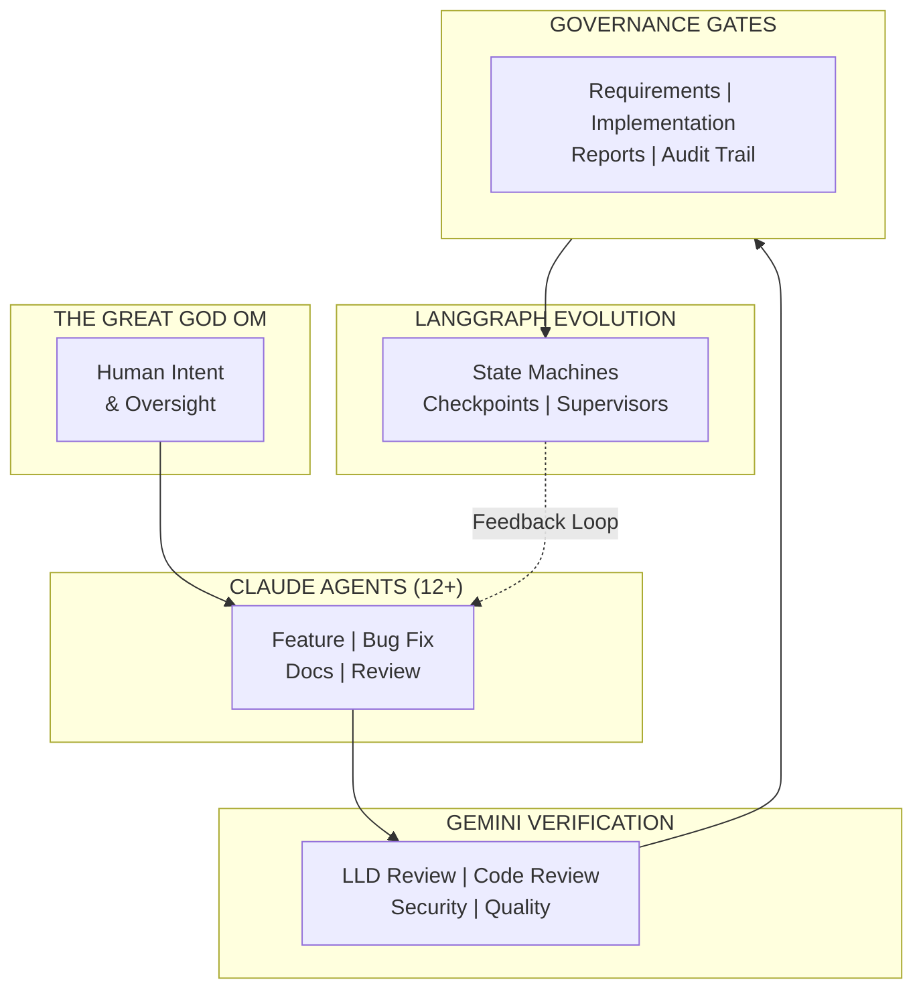
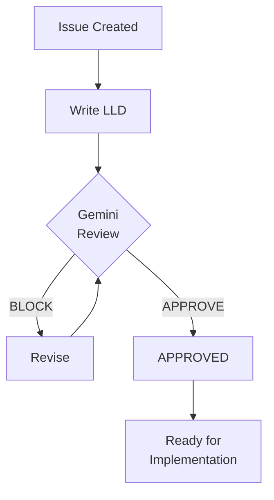
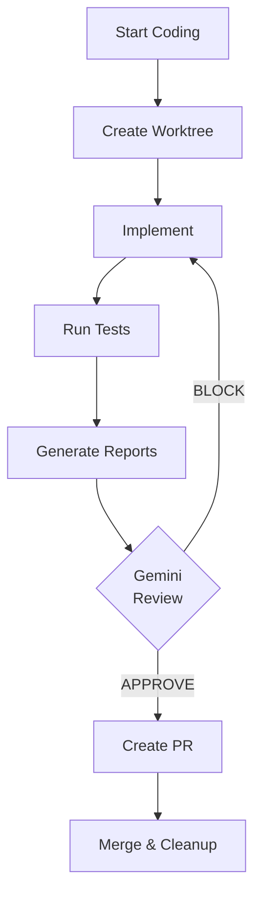

# AgentOS

## Multi-Agent Orchestration Platform for Enterprise AI Development

> Run 12+ AI agents concurrently. One identity. Full governance. Measurable ROI.

---

## Production Evidence: 50 Issues Closed

AgentOS isn't theoretical. It's been battle-tested through **50 completed issues** spanning:

| Theme | Issues | Examples |
|-------|--------|----------|
| **Workflow Automation** | 15 | LLD workflow, implementation workflow, report generation |
| **Governance & Gates** | 12 | Gemini verification, skipped test gates, mechanical validation |
| **Developer Experience** | 10 | Permission friction, worktree isolation, CI/CD |
| **Intelligence Layer** | 8 | Scout workflow, verdict analyzer, template learning |
| **Infrastructure** | 5 | GitHub Actions, Poetry dependencies, cross-platform |

**Current velocity:** ~3 issues/day with multi-agent orchestration

---

## The Problem We Solve

AI coding assistants like Claude Code and GitHub Copilot are transforming software development. But **enterprise adoption stalls** because:

| Challenge | Reality |
|-----------|---------|
| **No coordination** | Multiple agents conflict and duplicate work |
| **No governance** | Security teams can't approve ungoverned AI |
| **No verification** | AI-generated code goes unreviewed |
| **No metrics** | Leadership can't prove ROI |
| **Permission friction** | Constant approval prompts destroy flow state |

Organizations run pilots. Developers love the tools. Then adoption plateaus at 10-20% because **the infrastructure layer is missing**.

---

## The Solution

AgentOS provides that infrastructure layer:

| Capability | What It Does | Enterprise Value |
|------------|--------------|------------------|
| **Multi-Agent Orchestration** | 12+ concurrent agents, one identity | Scale without chaos |
| **Gemini Verification** | AI reviews AI before humans approve | Quality gates that work |
| **Governance Gates** | Enforced checkpoints (design, code, docs) | Security team approval |
| **Permission Management** | Eliminate friction, track patterns | Developer productivity |
| **34 Audits** | Security, privacy, AI safety, compliance | Compliance readiness |
| **Metrics & KPIs** | Adoption, friction, cost, productivity | Prove ROI to leadership |

---

## For Different Audiences

### Engineering Leaders
- [Why AgentOS?](For-Enterprise-Leaders-Why-AgentOS) - Business case, ROI, adoption strategy
- [Measuring Productivity](Measuring-Productivity) - KPIs, dashboards, metrics that matter
- [Security & Compliance](Security-Compliance) - What security teams need to approve

### Architects & Technical Leaders
- [Multi-Agent Orchestration](Multi-Agent-Orchestration) - **The headline feature**
- [Gemini Verification](Gemini-Verification) - Claude + Gemini architecture
- [LangGraph Evolution](LangGraph-Evolution) - **The roadmap** (state machines, checkpointing)
- [How the AgentOS Learns](How-the-AgentOS-Learns) - Self-improving governance feedback loop

### Developers
- [Quick Start](Quick-Start) - 5-minute setup
- [Permission Friction](Permission-Friction) - The #1 adoption blocker solved
- [Why Windows?](Why-Windows) - Cross-platform design decisions

### Security & Compliance Teams
- [Governance Gates](Governance-Gates) - LLD, implementation, report gates
- [Security Compliance](Security-Compliance) - OWASP, GDPR, AI Safety audits

---

## Core Workflows

AgentOS implements two primary governed workflows:

### Requirements Workflow

Design documents are reviewed by Gemini before any code is written. [Learn more](Requirements-Workflow)

### Implementation Workflow

Code is reviewed by Gemini before PR creation. [Learn more](Implementation-Workflow)

---

## Roadmap: LangGraph Evolution

AgentOS is **production-ready today** with prompt-based orchestration. The roadmap transforms it into an enterprise-grade state machine platform:

| Timeline | Milestone | Impact |
|----------|-----------|--------|
| **Q1 2026** | LangGraph state machines, checkpointing | Gates enforced, not suggested |
| **Q2 2026** | Supervisor pattern, LangSmith observability | Autonomous task decomposition |
| **Q3 2026** | Dynamic tool graphs, multi-tenant support | Scale to organizations |

See: [LangGraph Evolution](LangGraph-Evolution) for the full technical vision.

---

## Key Differentiators

### 1. Multi-Model Verification (Unique)
Claude builds code. Gemini reviews it. This isn't just "two models" - it's adversarial verification where one AI checks another's work before humans approve. [Learn more](Gemini-Verification)

### 2. Friction-First Approach
We obsess over permission friction because it's the #1 adoption killer. Our friction logging protocol (Zugzwang) identifies patterns, and our tools auto-remediate them. [Learn more](Permission-Friction)

### 3. Self-Improving Governance
The system learns from Gemini verdicts to improve templates automatically. 164 verdicts analyzed, 6 template sections added. [Learn more](How-the-AgentOS-Learns)

### 4. Discworld Personas
Every workflow has a [Discworld character](Dramatis-Personae) defining its philosophy. This isn't whimsy - it's intuitive system design. Vimes guards (regression tests), Lu-Tze sweeps (janitor), Brutha remembers (RAG).

---

## The Cast

| Persona | Function | Philosophy |
|---------|----------|------------|
| **[The Great God Om](The-Great-God-Om)** | Human Orchestrator | Pure Intent |
| **Moist von Lipwig** | Pipeline Orchestration | Keep messages moving |
| **Lord Vetinari** | Work Visibility | Information is power |
| **Commander Vimes** | Regression Tests | Deep suspicion |
| **Captain Angua** | External Intelligence | Sensory awareness |
| **Brutha** | RAG Memory | Perfect recall |
| **Lu-Tze** | Maintenance | Constant sweeping |

[Full cast →](Dramatis-Personae)

---

## Get Started

1. **Read the architecture**: [Multi-Agent Orchestration](Multi-Agent-Orchestration)
2. **Understand the roadmap**: [LangGraph Evolution](LangGraph-Evolution)
3. **See the metrics**: [Measuring Productivity](Measuring-Productivity)
4. **Try it**: [Quick Start](Quick-Start)

---

*"A man is not dead while his name is still spoken."*
**GNU Terry Pratchett**
