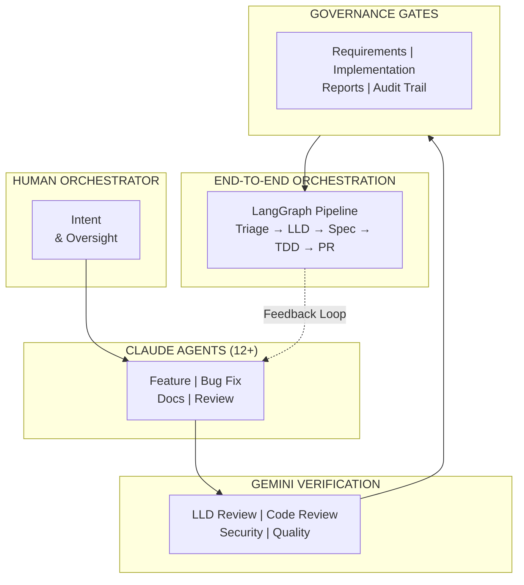
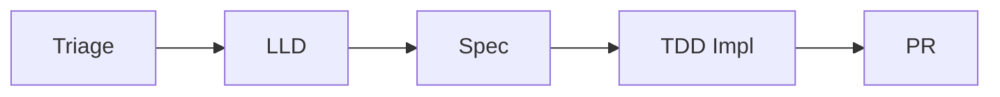
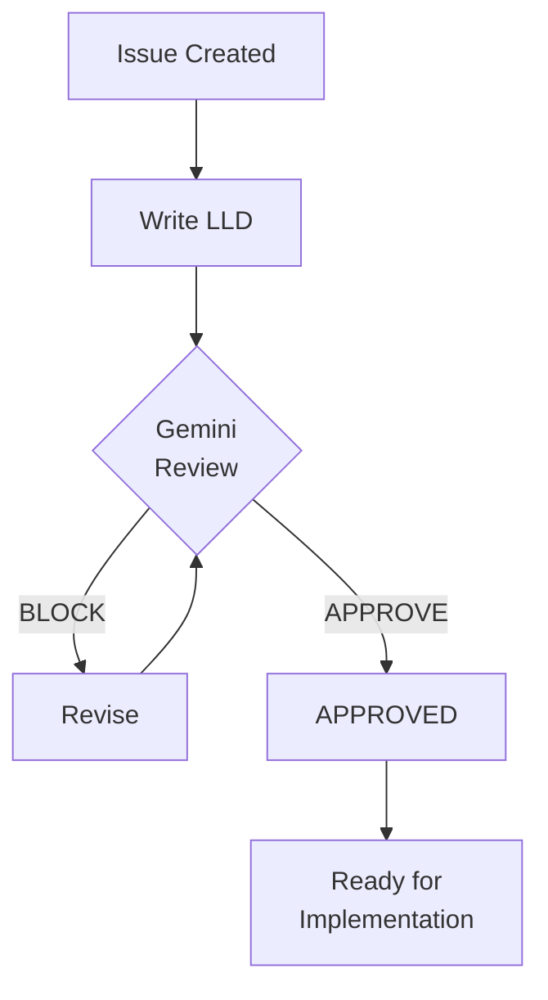
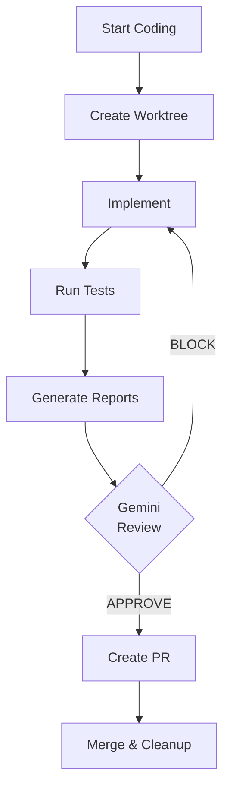

# AssemblyZero

## Multi-Agent Orchestration Platform for Enterprise AI Development

> Run 12+ AI agents concurrently. One identity. Full governance. Measurable ROI.


```mermaid
graph TD
    subgraph Intent["HUMAN ORCHESTRATOR"]
        O["Intent<br/>& Oversight"]
    end

    subgraph Agents["CLAUDE AGENTS (12+)"]
        A["Feature | Bug Fix<br/>Docs | Review"]
    end

    subgraph Verify["GEMINI VERIFICATION"]
        G["LLD Review | Code Review<br/>Security | Quality"]
    end

    subgraph Gov["GOVERNANCE GATES"]
        M["Requirements | Implementation<br/>Reports | Audit Trail"]
    end

    subgraph Orch["END-TO-END ORCHESTRATION"]
        R["LangGraph Pipeline<br/>Triage → LLD → Spec → TDD → PR"]
    end

    O --> A
    A --> G
    G --> Gov
    Gov --> R
    R -.->|"Feedback Loop"| A
```

---

## Production Evidence: 310 Issues, 286 Closed

AssemblyZero isn't theoretical. It's been battle-tested through **310 issues** (286 closed, 24 open) across 48 days — with 727 commits since the last major update:

**[View Full Metrics Dashboard →](Metrics)**

```
Issues closed per day (Central Time):
2026-01-17:   9 #########
2026-01-21:  12 ############
2026-02-03:  60 ############################################################
2026-02-05:  19 ###################
2026-02-15:  12 ############
2026-02-17:  24 ########################
2026-02-25:  20 ####################
2026-02-26:  17 #################
2026-02-27:   4 ####
```

| Theme | Examples |
|-------|----------|
| **Workflow Automation** | LLD workflow, implementation workflow, TDD workflow |
| **Governance & Gates** | Gemini verification, mechanical validation, skipped test gates |
| **Bug Fixes** | Unicode encoding, import errors, stale state bugs |
| **Intelligence Layer** | Scout workflow, verdict analyzer, template learning, RAG injection |
| **Infrastructure** | GitHub Actions, Poetry dependencies, cross-platform, telemetry |

**Current velocity:** 6.1 issues/day average | **Closure rate:** 92.3% | **Peak day:** 60 closes (Feb 3)

---

## What's New (Q1 2026)

Major features shipped in the last 712 commits:

| Feature | What It Does | Wiki Page |
|---------|-------------|-----------|
| **End-to-End Orchestration** | LangGraph pipeline: Triage → LLD → Spec → TDD → PR. Resumable, retryable, gated. | [End-to-End Pipeline](End-to-End-Orchestration) |
| **Cost Management** | Per-call tracking, $5 budget guard, iteration circuit breaker, FallbackProvider economics | [Cost Management](Cost-Management) |
| **Telemetry System** | DynamoDB + JSONL, fire-and-forget, 90-day TTL, kill switch | [Observability](Observability-and-Monitoring) |
| **Cascade Prevention** | 15+ patterns, 4 categories, risk scoring, auto-approve blocking | [Safety & Guardrails](Safety-and-Guardrails) |
| **Multi-Framework TDD** | Auto-detects pytest/Playwright/Jest/Vitest, unified TestRunResult | [Orchestration](End-to-End-Orchestration#multi-framework-test-support) |
| **Circuit Breakers** | Token budget estimation, FallbackProvider failover, stagnation detection | [Cost Management](Cost-Management#layer-3-iteration-circuit-breaker) |
| **Structured LLM Logging** | Every call: `[LLM] provider=X model=Y input=N output=M cost=$X.XX cumulative=$Y.YY` | [Observability](Observability-and-Monitoring#structured-llm-call-logging) |
| **3,386 Tests** | 134 test files, 105 unit test files, full coverage of all subsystems | [Orchestration](End-to-End-Orchestration#test-suite) |

---

## The Problem We Solve

AI coding assistants like Claude Code and GitHub Copilot are transforming software development. But **enterprise adoption stalls** because:

| Challenge | Reality |
|-----------|---------|
| **No coordination** | Multiple agents conflict and duplicate work |
| **No governance** | Security teams can't approve ungoverned AI |
| **No verification** | AI-generated code goes unreviewed |
| **No metrics** | Leadership can't prove ROI |
| **No cost control** | Token costs spiral without budgets or circuit breakers |
| **Permission friction** | Constant approval prompts destroy flow state |

Organizations run pilots. Developers love the tools. Then adoption plateaus at 10-20% because **the infrastructure layer is missing**.

---

## The Solution

AssemblyZero provides that infrastructure layer:

| Capability | What It Does | Enterprise Value |
|------------|--------------|------------------|
| **Multi-Agent Orchestration** | 12+ concurrent agents, one identity | Scale without chaos |
| **End-to-End Pipeline** | Triage → LLD → Spec → TDD → PR (automated) | Issue to PR in hours |
| **Gemini Verification** | AI reviews AI before humans approve | Quality gates that work |
| **Governance Gates** | Enforced checkpoints (design, code, docs) | Security team approval |
| **Cost Management** | Per-call tracking, budgets, circuit breakers | Predictable spend |
| **Observability** | Telemetry, audit trails, structured logging | Full visibility |
| **Safety & Guardrails** | Kill switches, cascade prevention, rollback | Responsible deployment |
| **Permission Management** | Eliminate friction, track patterns | Developer productivity |
| **34 Audits** | Security, privacy, AI safety, compliance | Compliance readiness |
| **Metrics & KPIs** | Adoption, friction, cost, productivity | Prove ROI to leadership |

---

## For Different Audiences

### Engineering Leaders
- [Why AssemblyZero?](For-Enterprise-Leaders-Why-AssemblyZero) - Business case, ROI, adoption strategy
- [Measuring Productivity](Measuring-Productivity) - KPIs, dashboards, metrics that matter
- [Security & Compliance](Security-Compliance) - What security teams need to approve

### Architects & Technical Leaders
- [Multi-Agent Orchestration](Multi-Agent-Orchestration) - **The headline feature**
- [End-to-End Pipeline](End-to-End-Orchestration) - Triage → LLD → Spec → TDD → PR
- [Gemini Verification](Gemini-Verification) - Claude + Gemini architecture
- [LangGraph Evolution](LangGraph-Evolution) - State machines and checkpointing
- [How the AssemblyZero Learns](How-the-AssemblyZero-Learns) - Self-improving governance feedback loop

### Operations & Observability
- [Observability & Monitoring](Observability-and-Monitoring) - Telemetry, audit trails, stagnation detection
- [Cost Management](Cost-Management) - Budgets, circuit breakers, provider pricing
- [Safety & Guardrails](Safety-and-Guardrails) - Kill switches, cascade prevention, rollback

### Developers
- [Quick Start](Quick-Start) - 5-minute setup
- [Permission Friction](Permission-Friction) - The #1 adoption blocker solved
- [Why Windows?](Why-Windows) - Cross-platform design decisions

### Security & Compliance Teams
- [Governance Gates](Governance-Gates) - LLD, implementation, report gates
- [Safety & Guardrails](Safety-and-Guardrails) - Kill switches, responsible AI practices
- [Security Compliance](Security-Compliance) - OWASP, GDPR, AI Safety audits

---

## Core Workflows

AssemblyZero implements a five-stage governed pipeline:

### End-to-End Pipeline

```mermaid
graph LR
    T["Triage"] --> L["LLD"]
    L --> S["Spec"]
    S --> I["TDD Impl"]
    I --> P["PR"]
```

Issue → Triage → Design → Spec → Code + Tests → Pull Request. Each stage is retryable, resumable, and gated. [Learn more](End-to-End-Orchestration)

### Requirements Workflow

```mermaid
graph TD
    I["Issue Created"]
    L["Write LLD"]
    G{"Gemini<br/>Review"}
    R["Revise"]
    A["APPROVED"]
    C["Ready for<br/>Implementation"]

    I --> L
    L --> G
    G -->|"BLOCK"| R
    R --> G
    G -->|"APPROVE"| A
    A --> C
```

Design documents are reviewed by Gemini before any code is written. [Learn more](Requirements-Workflow)

### Implementation Workflow

```mermaid
graph TD
    S["Start Coding"]
    W["Create Worktree"]
    I["Implement"]
    T["Run Tests"]
    R["Generate Reports"]
    G{"Gemini<br/>Review"}
    P["Create PR"]
    M["Merge & Cleanup"]

    S --> W
    W --> I
    I --> T
    T --> R
    R --> G
    G -->|"BLOCK"| I
    G -->|"APPROVE"| P
    P --> M
```

Code is reviewed by Gemini before PR creation. [Learn more](Implementation-Workflow)

---

## Roadmap

AssemblyZero is **production-ready today** with LangGraph-based orchestration. The roadmap extends into enterprise-grade capabilities:

| Timeline | Milestone | Status |
|----------|-----------|--------|
| **Q1 2026** | LangGraph state machines, checkpointing | **SHIPPED** |
| **Q1 2026** | End-to-end orchestration pipeline | **SHIPPED** |
| **Q1 2026** | Cost management & circuit breakers | **SHIPPED** |
| **Q1 2026** | Telemetry system (DynamoDB + JSONL) | **SHIPPED** |
| **Q1 2026** | Multi-framework test support | **SHIPPED** |
| **Q1 2026** | Cascade prevention system | **SHIPPED** |
| **Q2 2026** | Supervisor pattern, LangSmith observability | In Progress |
| **Q3 2026** | Dynamic tool graphs, multi-tenant support | Planned |

See: [LangGraph Evolution](LangGraph-Evolution) for the full technical vision.

---

## Key Differentiators

### 1. Multi-Model Verification (Unique)
Claude builds code. Gemini reviews it. This isn't just "two models" - it's adversarial verification where one AI checks another's work before humans approve. [Learn more](Gemini-Verification)

### 2. Friction-First Approach
We obsess over permission friction because it's the #1 adoption killer. Our friction logging protocol (Zugzwang) identifies patterns, and our tools auto-remediate them. [Learn more](Permission-Friction)

### 3. Self-Improving Governance
The system learns from Gemini verdicts to improve templates automatically. 164 verdicts analyzed, 6 template sections added. [Learn more](How-the-AssemblyZero-Learns)

### 4. End-to-End Automation
From GitHub issue to pull request — fully automated, fully governed, fully observable. Five stages, three retry levels, resumable state. [Learn more](End-to-End-Orchestration)

### 5. Discworld Personas
Every workflow has a [Discworld character](Dramatis-Personae) defining its philosophy. This isn't whimsy - it's intuitive system design. Vimes guards (regression tests), Lu-Tze sweeps (janitor), Brutha remembers (RAG).

---

## Architecture

Detailed architecture documentation with Mermaid diagrams:

| Document | Content |
|----------|---------|
| **[System Overview](../docs/architecture/system-overview.md)** | Persona map, layer diagram, implementation status |
| **[Data Flow](../docs/architecture/data-flow.md)** | Pipeline flow (Brief → PR), RAG indexing/retrieval |
| **[Workflow Interactions](../docs/architecture/workflow-interactions.md)** | Workflow chaining, checkpointing, human gates |
| **[ADR-0210: Persona Convention](../docs/adrs/0210-discworld-persona-convention.md)** | Naming rules, when to create new personas |
| **[ADR-0211: RAG Architecture](../docs/adrs/0211-rag-architecture.md)** | Brutha foundation, Librarian/Hex/Historian consumers |
| **[ADR-0212: Local-Only Embeddings](../docs/adrs/0212-local-only-embeddings.md)** | Privacy rationale, model choice |

---

## The Cast

| Persona | Function | Philosophy | Status |
|---------|----------|------------|--------|
| **[The Great God Om](The-Great-God-Om)** | Human Orchestrator | Pure Intent | Active |
| **Moist von Lipwig** | Pipeline Orchestration | Keep messages moving | Implemented |
| **Lord Vetinari** | Work Visibility | Information is power | Planned |
| **Brutha** | RAG Vector Store | Perfect recall | Implemented |
| **The Librarian** | Document Retrieval | Protect the books | Implemented |
| **Hex** | Codebase Intelligence | Process. Compute. Return. | Implemented |
| **The Historian** | Duplicate Detection | History is a responsibility | Implemented |
| **Captain Angua** | External Intelligence | Sensory awareness | Implemented |
| **Lu-Tze** | Repository Hygiene | Constant sweeping | Implemented |
| **DEATH** | Doc Reconciliation | INEVITABLE. THOROUGH. | Manual |
| **Commander Vimes** | Regression Tests | Deep suspicion | Planned |

[Full cast →](Dramatis-Personae)

---

## Get Started

1. **Read the architecture**: [Multi-Agent Orchestration](Multi-Agent-Orchestration)
2. **See the pipeline**: [End-to-End Orchestration](End-to-End-Orchestration)
3. **Understand cost control**: [Cost Management](Cost-Management)
4. **See the metrics**: [Measuring Productivity](Measuring-Productivity)
5. **Try it**: [Quick Start](Quick-Start)

---

*"A man is not dead while his name is still spoken."*
**GNU Terry Pratchett**
