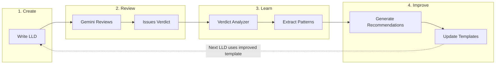
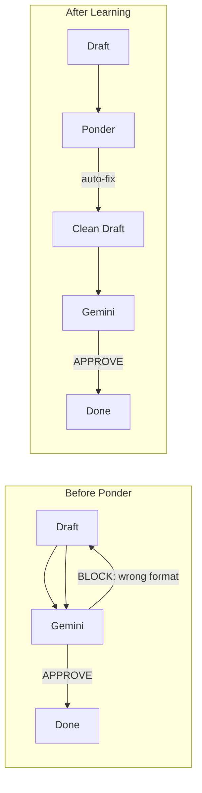

# How the AssemblyZero Learns

> *"Give a man a fish and you feed him for a day. Teach a man to fish and you feed him for a lifetime."*

---

## The Problem with Manual Feedback

Traditional AI development relies on humans reviewing outputs and manually adjusting prompts or templates. This creates a bottleneck:

```
Human reviews AI output → Human identifies pattern → Human updates template → Repeat
```

Every improvement requires human attention. The system doesn't learn from its mistakes.

---

## The Self-Improvement Loop

AssemblyZero introduces a **closed-loop learning system** where governance feedback automatically improves future work:



---

## How It Works

### Step 1: Governance Creates Verdicts

When Gemini reviews an LLD, it produces a verdict file with structured feedback:

```markdown
## Tier 1: BLOCKING Issues
### Security
- [ ] No input validation on user-provided paths

### Architecture
- [ ] Missing error handling for API timeouts
```

### Step 2: Verdict Analyzer Extracts Patterns

The `verdict-analyzer` tool scans all verdicts across repositories:

```bash
poetry run python tools/verdict-analyzer.py scan
# Processed 164 verdict(s)

poetry run python tools/verdict-analyzer.py stats
# Total Blocking Issues: 80
# By Category:
#   architecture: 23
#   quality: 23
#   security: 10
```

### Step 3: Patterns Become Recommendations

When the same issues appear repeatedly, they indicate gaps in our templates:

```bash
poetry run python tools/verdict-analyzer.py recommend docs/templates/0102-feature-lld-template.md
# Found 6 recommendation(s):
# 1. [add_section] Architecture & Design - Pattern count: 23
# 2. [add_section] Security Considerations - Pattern count: 10
```

### Step 4: Templates Evolve

The recommendations guide template improvements. On 2026-02-01, we added:

| New Section | Reason | Pattern Count |
|-------------|--------|---------------|
| 2.7 Architecture Decisions | Most common blocker | 23 |
| 7.2 Safety Considerations | Data loss, fail-safe issues | 9 |
| 8.2 Cost Analysis | API cost runaway concerns | 6 |
| 9. Legal & Compliance | PII, licensing issues | 8 |

---

## The Compound Effect

Each cycle makes the next cycle faster:

| Cycle | What Happens |
|-------|--------------|
| **Cycle 1** | LLD missing security section → Gemini blocks → Add security template |
| **Cycle 2** | LLD missing architecture → Gemini blocks → Add architecture template |
| **Cycle 3** | LLD now has both → Gemini approves faster |
| **Cycle N** | Templates comprehensive → First-pass approval rate increases |

**This is teaching the system to fish.**

---

## Current State (2026-02-01)

After analyzing 164 verdicts:

- **36 APPROVED** (22%)
- **128 BLOCKED** (78%)

Top blocking categories that are now addressed in templates:
1. Architecture (23) → New section 2.7
2. Quality (23) → Enhanced technical approach
3. Security (10) → Already existed, validated
4. Safety (9) → New section 7.2
5. Legal (8) → New section 9
6. Cost (6) → New section 8.2

---

## Learning Loop #2: Verdict-to-AutoFix

While the template improvement loop helps drafters write better LLDs, there's a faster path for **mechanical fixes**: promote common Gemini corrections directly to Ponder Stibbons (The Compositor).



### How It Works

1. **Gemini blocks** a draft for a mechanical issue (e.g., "Section 11 uses ### instead of ##")
2. **Verdict Analyzer** tracks this pattern across verdicts
3. **Pattern threshold** reached (default: 3 occurrences)
4. **Human approves** promotion to auto-fix
5. **Ponder fixes** this automatically in future drafts

### Example

| Step | What Happens |
|------|--------------|
| **Verdict 1** | LLD-099 blocked: "Section header format wrong" |
| **Verdict 2** | LLD-101 blocked: "Section header format wrong" |
| **Verdict 3** | LLD-105 blocked: "Section header format wrong" |
| **Analyzer** | Flags pattern: `### 11.` should be `## 11.` |
| **Promotion** | Human approves auto-fix rule |
| **Future** | Ponder fixes this before Gemini sees it |

### Why This Matters

| Metric | Before | After |
|--------|--------|-------|
| Gemini calls for format issues | 2+ per LLD | 0 |
| Time per format fix | 30-60 seconds | Instant |
| Cost per format fix | ~$0.05 | $0 |

**The system learns which corrections are mechanical and stops bothering Gemini with them.**

### Related

- [#307 - Ponder Stibbons (The Compositor)](https://github.com/martymcenroe/AssemblyZero/issues/307)
- [#308 - Verdict-to-AutoFix Pipeline](https://github.com/martymcenroe/AssemblyZero/issues/308)

---

## Future: The Janitor

The current process requires manual invocation:

```bash
# Human runs this periodically
poetry run python tools/verdict-analyzer.py scan
poetry run python tools/verdict-analyzer.py recommend ... --apply
```

**Coming soon:** The "Janitor" agent will run this automatically:
- Scheduled analysis of new verdicts
- Automatic template improvement proposals
- Human-in-the-loop approval before applying changes

The goal: **Zero human intervention for routine improvements.**

---

## Why This Matters

Most AI systems are static - they don't learn from deployment feedback. AssemblyZero is different:

| Traditional AI | AssemblyZero |
|----------------|---------|
| Fixed prompts | Evolving templates |
| Manual tuning | Automated pattern extraction |
| Human bottleneck | Self-improving loop |
| Same mistakes repeated | Mistakes become improvements |

**The system gets smarter every time it fails.**

---

## Try It Yourself

```bash
# See what the system has learned
poetry run python tools/verdict-analyzer.py stats

# See recommendations for any template
poetry run python tools/verdict-analyzer.py recommend path/to/template.md

# Apply improvements
poetry run python tools/verdict-analyzer.py recommend path/to/template.md --apply --no-dry-run
```

---

## Related

- [[Verdict Analyzer - Template Improvement from Gemini Verdicts]]
- [[Unified Governance Workflow]]
- [Issue #104](https://github.com/martymcenroe/AssemblyZero/issues/104) - Verdict Analyzer implementation
