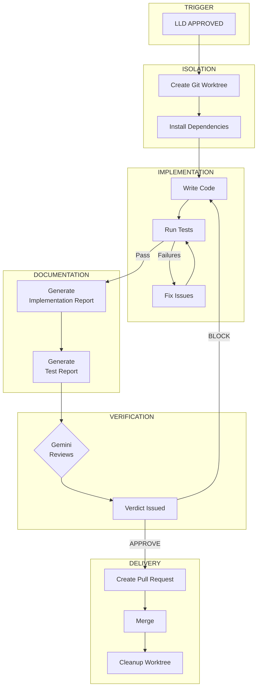
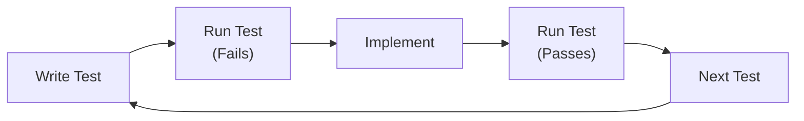

# Implementation Workflow

> *"The code is written. The tests pass. But the work isn't done until The Watch has verified it."*

The Implementation Workflow takes an approved LLD through coding, testing, review, and merge.

---

## Overview



---

## Phase 1: Worktree Isolation

**Every implementation happens in an isolated worktree.** This is non-negotiable.

### Why Worktrees?

Multiple agents work on AssemblyZero simultaneously. Direct commits to main would cause conflicts and corruption.

```bash
# Create worktree for issue #123
git worktree add ../AssemblyZero-123 -b 123-feature-name
cd ../AssemblyZero-123
poetry install
```

### What Requires a Worktree

| Change Type | Worktree Required |
|-------------|-------------------|
| `.py`, `.js`, `.ts` files | Yes |
| `pyproject.toml`, `package.json` | Yes |
| Infrastructure, deployment | Yes |
| Bug fixes (even "quick" ones) | Yes |
| Documentation only (`docs/**/*.md`) | No |
| `CLAUDE.md` updates | No |

---

## Phase 2: Implementation

### Following the LLD

The approved LLD specifies:
- Files to create/modify
- API contracts
- Data models
- Test requirements

Claude implements according to the LLD. Deviations require explanation in the implementation report.

### Test-First Development



### Skipped Test Gate

If tests are skipped, they must be audited:

```markdown
SKIPPED TEST AUDIT:
- [SKIPPED] "test_firefox_extension"
  - Verifies: Extension loads in Firefox
  - Skip reason: Firefox not installed in CI
  - Critical: YES (core feature)
  - Alt verification: NONE
  - Status: UNVERIFIED ← BLOCKS MERGE
```

**UNVERIFIED critical tests block merge.**

---

## Phase 3: Report Generation

Two reports are required before Gemini review:

### Implementation Report

```markdown
# Implementation Report: Feature Name

## Issue Reference
[#123](https://github.com/...)

## Files Changed
| File | Change Type | Description |
|------|-------------|-------------|
| src/feature.py | Added | Main implementation |
| tests/test_feature.py | Added | Unit tests |

## Design Decisions
Why specific approaches were chosen.
Any deviations from LLD with justification.

## Known Limitations
What doesn't work or is incomplete.

## Testing
How changes were tested beyond unit tests.
```

### Test Report

```markdown
# Test Report: Feature Name

## Test Command
pytest tests/test_feature.py -v

## Full Output
[COMPLETE output - not paraphrased]

## Coverage
| File | Lines | Coverage |
|------|-------|----------|
| src/feature.py | 120 | 87% |

## Skipped Tests
| Test | Reason | Critical |
|------|--------|----------|
| test_edge | Mock unavailable | No |
```

---

## Phase 4: Gemini Review

Reports and diff are submitted to Gemini for review.

### Review Criteria

| Category | Questions |
|----------|-----------|
| **Code Quality** | Readable? Maintainable? |
| **Pattern Compliance** | Follows project conventions? |
| **Test Coverage** | Adequate for changes? |
| **Security** | No vulnerabilities introduced? |
| **Documentation** | Updated appropriately? |
| **LLD Compliance** | Implements what was designed? |

### Verdict Outcomes

| Verdict | Action |
|---------|--------|
| **APPROVE** | Proceed to PR creation |
| **BLOCK** | Fix issues, regenerate reports, re-submit |

### Approval Rates

| Outcome | Rate |
|---------|------|
| First-pass APPROVE | 75-85% |
| After 1 revision | 95%+ |
| After 2+ revisions | 99%+ |

---

## Phase 5: Pull Request

Once Gemini approves:

```bash
gh pr create --title "feat: implement feature (#123)" --body "..."
```

### PR Template

```markdown
## Summary
- What this PR does
- Related issue: #123

## Changes
- List of changes

## Test Plan
- How to verify

## Gemini Verdict
[APPROVED] - Implementation passed review
```

---

## Phase 6: Merge & Cleanup

After PR merge:

```bash
# 1. Archive lineage
python tools/archive_worktree_lineage.py --worktree ../AssemblyZero-123 --issue 123

# 2. Remove worktree
git worktree remove ../AssemblyZero-123

# 3. Delete branches
git branch -d 123-feature-name
git push origin --delete 123-feature-name

# 4. Pull changes
git pull
```

**Cleanup is mandatory.** Stale worktrees and branches confuse future agents.

---

## Lineage After Implementation

The lineage directory grows to include implementation artifacts:

```
docs/lineage/archived/{issue}-lld/
├── 001-issue.md
├── 002-draft.md
├── 003-verdict.md
├── 004-draft.md
├── 005-verdict.md
├── 006-final.md           # Approved LLD
├── 007-approved.json
├── 008-impl-report.md     # Implementation report
├── 009-test-report.md     # Test report
├── 010-impl-verdict.md    # Gemini's code review
└── 011-pr.md              # PR link and merge info
```

---

## Commander Vimes: The Watch

[Commander Vimes](Dramatis-Personae#commander-vimes) guards the implementation workflow:

> *"Who watches the watchmen? We do."*

The Watch provides:
- Regression test execution before merge
- Baseline comparison against main
- Automatic issue creation for new failures
- Go/no-go signals for risky merges

---

## Metrics

| Metric | Target | Warning |
|--------|--------|---------|
| Implementation time | < 4 hours | > 8 hours |
| Test coverage | > 80% | < 60% |
| First-pass approval | > 80% | < 60% |
| Revisions needed | < 1.5 | > 2.5 |
| Cleanup completed | 100% | < 100% |

---

## Common Block Reasons

| Reason | Frequency | Prevention |
|--------|-----------|------------|
| Missing test coverage | 40% | TDD approach |
| Security issues | 25% | Security section in LLD |
| Pattern violations | 20% | Code review before submit |
| Missing docs | 10% | Documentation checklist |
| Other | 5% | - |

---

## Related

- [Requirements Workflow](Requirements-Workflow) - How LLDs get approved
- [Governance Gates](Governance-Gates) - All gates explained
- [Gemini Verification](Gemini-Verification) - Multi-model architecture
- [Dramatis Personae](Dramatis-Personae) - Commander Vimes and The Watch

---

*"'The law is the law,' said Carrot. 'That's what makes it the law.'"*
— Terry Pratchett, *Men at Arms*
