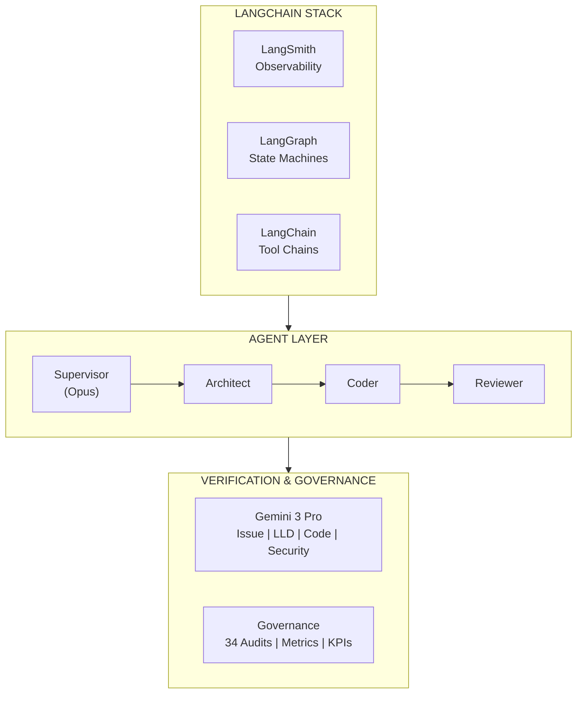

# LangGraph Evolution

> The roadmap: From prompt-based orchestration to enterprise-grade state machines

---

## Vision

AssemblyZero is **production-ready today** with prompt-based orchestration. The LangGraph evolution transforms it from sophisticated scripting into an enterprise agentic platform with:

- **Enforced state machines** - Gates are impossible to skip, not just discouraged
- **Checkpoint recovery** - Long tasks survive interruptions
- **Supervisor pattern** - Autonomous task decomposition
- **Full observability** - LangSmith dashboards for every metric

This is the infrastructure layer that enterprises need to scale AI coding assistants across their engineering organizations.

---

## Current State vs. Future State

| Capability | Current (Prompt-Based) | Future (LangGraph) |
|------------|------------------------|---------------------|
| **Governance gates** | CLAUDE.md instructions | State machine enforcement |
| **Context survival** | Lost on compaction | Checkpointed to database |
| **Task routing** | Human assigns manually | Supervisor auto-routes |
| **Metrics** | Log parsing | LangSmith dashboards |
| **Multi-tenant** | Single user | Organization-wide |
| **Failure recovery** | Manual restart | Auto-resume |

---

## Phase 1: State Machine Formalization (Q1 2026)

### The Problem

Current governance gates rely on Claude following `CLAUDE.md` instructions:

```markdown
# Current: Instructions that CAN be ignored

## LLD REVIEW GATE (BEFORE CODING)

Before writing ANY code for an issue, execute this gate:
1. Submit LLD to Gemini for review
2. If [APPROVE] → proceed to coding
3. If [BLOCK] → fix issues before coding
```

A sufficiently creative prompt could bypass these. An agent under pressure might "forget" them during context compaction.

### The Solution

LangGraph state machines make gates **structurally impossible** to skip:

```python
from langgraph.graph import StateGraph, END
from typing import TypedDict, Literal

class AgentWorkflow(TypedDict):
    """State that persists across the entire workflow"""
    issue_id: str
    lld_status: Literal["draft", "reviewing", "approved", "blocked"]
    impl_status: Literal["pending", "coding", "reviewing", "merged"]
    gemini_verdict: Optional[str]
    human_override: bool

workflow = StateGraph(AgentWorkflow)

# Define nodes (each is a function that transforms state)
workflow.add_node("draft_lld", draft_lld_node)
workflow.add_node("gemini_lld_review", gemini_review_node)
workflow.add_node("human_approval", human_in_the_loop)
workflow.add_node("implement", implementation_node)
workflow.add_node("gemini_code_review", gemini_review_node)
workflow.add_node("create_pr", pr_creation_node)

# Define edges (transitions between states)
workflow.add_edge("draft_lld", "gemini_lld_review")

# Conditional edges based on Gemini verdict
def route_by_verdict(state: AgentWorkflow) -> str:
    if state["gemini_verdict"] == "APPROVE":
        return "implement"
    elif state["gemini_verdict"] == "BLOCK":
        return "draft_lld"  # Back to revision
    else:
        return "human_approval"  # Escalate

workflow.add_conditional_edges(
    "gemini_lld_review",
    route_by_verdict,
    {
        "implement": "implement",
        "draft_lld": "draft_lld",
        "human_approval": "human_approval"
    }
)

# The graph CANNOT advance without going through gates
# There is no "skip to implementation" edge
```

**Why this matters:**
- The state machine defines what transitions are possible
- "Skip the LLD review" isn't an option - there's no edge for it
- The workflow is auditable - every transition is recorded
- Security teams can review the graph, not trust prompt instructions

---

## Phase 2: Checkpointing & Recovery (Q1 2026)

### The Problem

Claude Code sessions lose context:
- Context compaction drops operational constraints
- Rate limiting interrupts multi-hour tasks
- Power failures (yes, this happens) lose everything
- Human goes to lunch, comes back to confusion

### The Solution

LangGraph checkpointing persists state to database:

```python
from langgraph.checkpoint.sqlite import SqliteSaver

# Create a checkpointer that saves state
checkpointer = SqliteSaver.from_conn_string("agents.db")

# Compile the workflow with checkpointing
app = workflow.compile(checkpointer=checkpointer)

# Each invocation saves state
config = {"configurable": {"thread_id": "issue-47-feature"}}

# First run - starts fresh
result = app.invoke(initial_state, config)
# State saved: lld_status="reviewing", impl_status="pending"

# ... interruption (rate limit, context compaction, lunch) ...

# Second run - RESUMES from checkpoint
result = app.invoke(None, config)  # None = continue from saved state
# Picks up right where it left off
```

**Recovery scenarios:**

| Scenario | Without Checkpointing | With Checkpointing |
|----------|----------------------|-------------------|
| Context compaction | Start over, lose context | Resume with full state |
| Rate limiting | Manual restart | Auto-resume after cooldown |
| Power failure | Lost work | Resume from last checkpoint |
| Human interruption | Re-explain everything | Continue seamlessly |

**Database schema for checkpoints:**

```sql
CREATE TABLE checkpoints (
    thread_id TEXT PRIMARY KEY,
    state JSONB NOT NULL,
    created_at TIMESTAMP,
    updated_at TIMESTAMP,
    parent_id TEXT,  -- For branching/versioning
    metadata JSONB   -- Issue ID, agent info, etc.
);
```

---

## Phase 3: Supervisor Pattern (Q2 2026)

### The Problem

Currently, humans manually route tasks to agents:
- "Agent 1, work on the feature"
- "Agent 2, fix the bug"
- "Agent 3, update the docs"

This doesn't scale. A 10-story epic requires constant human attention.

### The Solution

A supervisor agent coordinates workers:

```python
from langgraph_supervisor import create_supervisor

# Define specialized worker agents
architect_agent = create_react_agent(
    model=ChatAnthropic(model="claude-sonnet-4"),
    tools=[read_codebase, design_lld, review_patterns],
    system_prompt="You are an architect agent. Design solutions."
)

coder_agent = create_react_agent(
    model=ChatAnthropic(model="claude-sonnet-4"),
    tools=[edit_code, run_tests, create_pr],
    system_prompt="You are a coding agent. Implement designs."
)

reviewer_agent = create_react_agent(
    model=ChatAnthropic(model="claude-sonnet-4"),
    tools=[analyze_diff, check_patterns, write_review],
    system_prompt="You are a review agent. Review implementations."
)

security_agent = create_react_agent(
    model=ChatAnthropic(model="claude-sonnet-4"),
    tools=[owasp_audit, check_dependencies, scan_secrets],
    system_prompt="You are a security agent. Find vulnerabilities."
)

# Create supervisor that routes between them
supervisor = create_supervisor(
    agents=[
        ("architect", architect_agent),
        ("coder", coder_agent),
        ("reviewer", reviewer_agent),
        ("security", security_agent),
    ],
    model=ChatAnthropic(model="claude-opus-4"),  # Smarter model for routing
    prompt="""
    You are a tech lead coordinating a development team.
    Route tasks to the appropriate agent based on what's needed.
    Ensure proper sequencing: architect → coder → reviewer + security
    """
)

# Give it an epic, it breaks it down
result = supervisor.invoke({
    "input": """
    Epic: Add user authentication system
    - Design OAuth2 flow
    - Implement login/logout
    - Add session management
    - Security review before merge
    """
})
# Supervisor automatically:
# 1. Routes to architect for OAuth2 design
# 2. Routes to coder for implementation
# 3. Routes to reviewer AND security in parallel
# 4. Collects results and reports back
```

**Why this matters for RealPage:**
- Scale from "one person orchestrates" to "system orchestrates"
- Human becomes strategic reviewer, not tactical router
- Complex epics decompose automatically
- Consistent patterns across all work

---

## Phase 4: LangSmith Observability (Q2 2026)

### The Problem

"How do I prove ROI to leadership?" requires metrics:
- Cost per feature
- Time to completion
- Approval rates
- Adoption trends

Currently this requires log parsing and manual analysis.

### The Solution

LangSmith provides observability out of the box:

```python
import os

# Enable tracing
os.environ["LANGCHAIN_TRACING_V2"] = "true"
os.environ["LANGCHAIN_API_KEY"] = "..."
os.environ["LANGCHAIN_PROJECT"] = "assemblyzero-production"

# Every agent action is now traced automatically
# No code changes needed - just environment variables
```

**Dashboard capabilities:**

| Metric | What It Shows | Business Value |
|--------|---------------|----------------|
| **Token usage** | Per agent, per task, per feature | Cost attribution |
| **Latency percentiles** | P50, P95, P99 by operation | Performance tracking |
| **Error rates** | By gate type, by agent | Quality signals |
| **Trace analysis** | Full reasoning chain | Debugging, auditing |
| **Cost attribution** | $ per feature delivered | ROI calculation |
| **Approval rates** | Gemini pass/fail ratios | Gate effectiveness |

**Example queries:**

```
# Cost per feature this quarter
SELECT feature_id, SUM(token_cost) as total_cost
FROM traces
WHERE quarter = 'Q1-2026'
GROUP BY feature_id
ORDER BY total_cost DESC;

# Gemini approval rates by gate type
SELECT gate_type,
       COUNT(CASE WHEN verdict = 'APPROVE' THEN 1 END) / COUNT(*) as approval_rate
FROM gemini_reviews
GROUP BY gate_type;

# Agent productivity (tasks completed per day)
SELECT agent_id, DATE(completed_at), COUNT(*) as tasks_completed
FROM completed_tasks
GROUP BY agent_id, DATE(completed_at);
```

---

## Phase 5: Dynamic Tool Graphs (Q3 2026)

### The Problem

Current agents have static tool sets. But:
- Security bugs need security tools
- UI features need frontend tools + design review
- Performance work needs profiler + DB tools

Static tool sets either:
- Include everything (slow, expensive, confused)
- Include too little (agent can't complete task)

### The Solution

Dynamic tool selection based on task analysis:

```python
from langgraph.graph import StateGraph

class ToolSelectionState(TypedDict):
    task_description: str
    task_type: Optional[str]
    selected_tools: List[str]
    agent_context: dict

tool_graph = StateGraph(ToolSelectionState)

def analyze_and_route(state: ToolSelectionState) -> ToolSelectionState:
    """LLM call to classify task and select tools"""
    analysis = classifier_model.invoke(
        f"Analyze this task and select appropriate tools: {state['task_description']}"
    )
    return {
        **state,
        "task_type": analysis.task_type,
        "selected_tools": analysis.recommended_tools
    }

def select_toolset(state: ToolSelectionState) -> str:
    """Route to appropriate toolset based on analysis"""
    if "security" in state["task_type"]:
        return "security_toolset"
    elif "frontend" in state["task_type"]:
        return "frontend_toolset"
    elif "database" in state["task_type"]:
        return "database_toolset"
    else:
        return "general_toolset"

tool_graph.add_node("analyze_task", analyze_and_route)
tool_graph.add_conditional_edges("analyze_task", select_toolset)

# "Fix this SQL injection vulnerability"
# → Analyzes as security task
# → Routes to security toolset (OWASP scanner, dependency checker, etc.)
# → Excludes irrelevant tools (UI components, etc.)
```

---

## The Complete Vision



---

## Migration Path

The evolution is incremental, not disruptive:

| Phase | Risk | Rollback |
|-------|------|----------|
| **Phase 1: State Machines** | Low - new code, doesn't break existing | Feature flag |
| **Phase 2: Checkpointing** | Low - additive | Disable checkpointer |
| **Phase 3: Supervisor** | Medium - changes workflow | Parallel operation |
| **Phase 4: LangSmith** | Very low - observability only | Remove env vars |
| **Phase 5: Dynamic Tools** | Medium - changes tool selection | Static fallback |

Each phase can be adopted independently. Organizations can run prompt-based and LangGraph-based workflows in parallel during transition.

---

## What This Means for Enterprise Adoption

| Enterprise Need | How LangGraph Delivers |
|-----------------|------------------------|
| "Agents skip review steps" | State machine enforcement |
| "Lost context on long tasks" | Checkpoint recovery |
| "Can't track agent costs" | LangSmith dashboards |
| "Agents step on each other" | Supervisor coordination |
| "No audit trail" | Structured traces |
| "Hard to scale to teams" | Multi-tenant orchestration |
| "Security can't approve" | Enforced gates + full observability |

**Bottom line:** AssemblyZero is production-ready TODAY. The LangGraph evolution transforms it from "sophisticated scripting" into "enterprise agentic platform" - the infrastructure that scales AI coding assistants across engineering organizations.

---

## Related Pages

- [Multi-Agent Orchestration](Multi-Agent-Orchestration) - Current architecture
- [Gemini Verification](Gemini-Verification) - Multi-model review layer
- [Measuring Productivity](Measuring-Productivity) - KPIs and metrics
- [Governance Gates](Governance-Gates) - Current gate implementation
