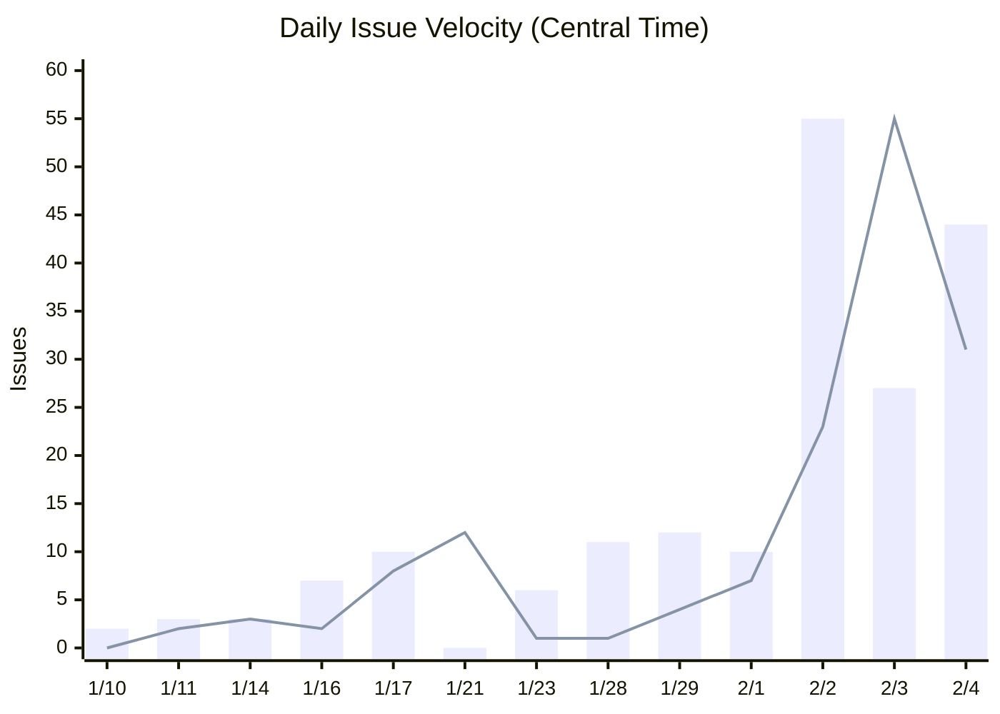
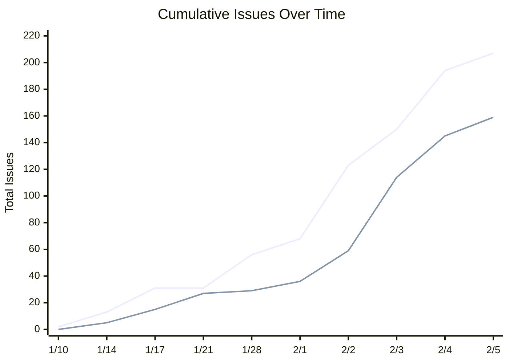
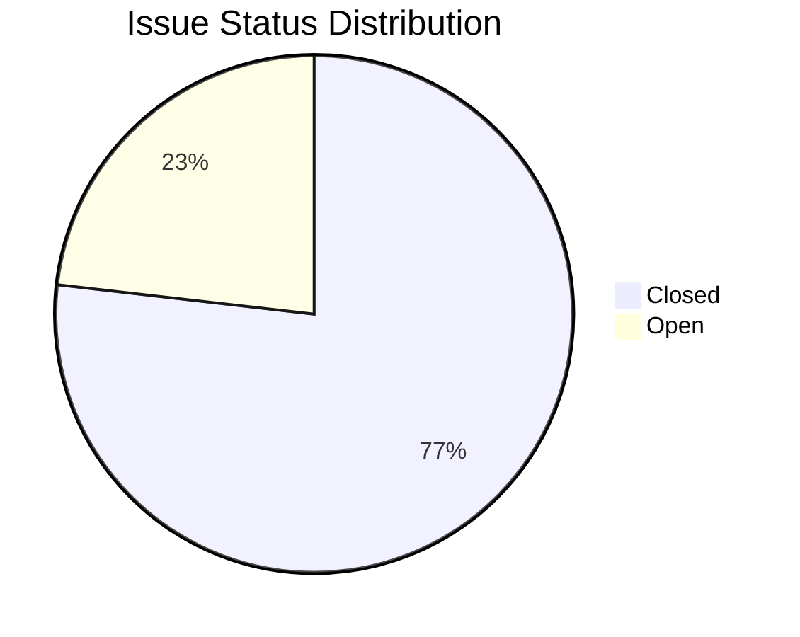

# AssemblyZero Metrics

> *"Taxation, gentlemen, is very much like dairy farming. The task is to extract the maximum amount of milk with the minimum amount of moo."*
> — Lord Vetinari

---

## Executive Summary

| Metric | Value |
|--------|-------|
| **Total Issues Created** | 207 |
| **Total Issues Closed** | 159 |
| **Currently Open** | 48 |
| **Closure Rate** | 76.8% |
| **Active Days** | 27 (Jan 10 - Feb 5) |
| **Average Velocity** | 5.9 closed/day |
| **Peak Day (Closes)** | 55 (Feb 3) |
| **Peak Day (Opens)** | 55 (Feb 2) |

---

## Velocity: Issues Opened vs Closed



**Legend:** Bars = Opened, Line = Closed

---

## Cumulative Progress



**Legend:** Top line = Total Created, Bottom line = Total Closed

---

## The Burn Rate

```
Jan 10-17:  ████████░░░░░░░░░░░░  30 opened, 15 closed (warmup)
Jan 21-29:  ██████████░░░░░░░░░░  37 opened, 26 closed (steady state)
Feb 01-05:  ████████████████████ 136 opened, 118 closed (hyperdrive)
```

**The inflection point:** Feb 2, when 55 issues were created in a single day. This marked the transition from "building AssemblyZero" to "AssemblyZero building itself."

---

## Velocity by Day of Week

| Day | Opened | Closed | Net |
|-----|--------|--------|-----|
| Friday | 12 | 10 | +2 |
| Saturday | 55 | 23 | +32 |
| Sunday | 27 | 55 | -28 |
| Monday | 44 | 31 | +13 |
| Tuesday | 69 | 40 | +29 |

**Observation:** Weekends are productive. Sunday Feb 3 closed 55 issues—more than most weeks.

---

## Issue Lifecycle



**Average time to close:** Most issues close within 24 hours of creation. The governance workflow (LLD → Gemini → Implementation → PR) typically completes in 2-4 hours for straightforward features.

---

## Cross-Project Usage

AssemblyZero is used by multiple repositories:

| Repository | Status | Issues Processed |
|------------|--------|------------------|
| **AssemblyZero** | Active | 207 |
| **RCA-PDF** | Active | TBD |
| **dispatch** | Planned | - |

> **Note:** Cross-project metrics aggregation is tracked in [#329](https://github.com/martymcenroe/AssemblyZero/issues/329)

---

## Future Metrics (Roadmap)

### Governance Metrics
| Metric | Description | Status |
|--------|-------------|--------|
| **LLD First-Pass Rate** | % of LLDs approved on first Gemini review | Planned |
| **Revision Count** | Average revisions before approval | Planned |
| **Gate Time** | Time spent in each governance gate | Planned |
| **Block Reasons** | Categorized reasons for BLOCK verdicts | Planned |

### Cost Metrics
| Metric | Description | Status |
|--------|-------------|--------|
| **Gemini API Cost** | Daily/weekly Gemini usage | Planned |
| **Claude API Cost** | Token usage by workflow | Planned |
| **Cost per Issue** | Total cost / issues closed | Planned |

### Quality Metrics
| Metric | Description | Status |
|--------|-------------|--------|
| **Test Coverage** | Aggregate coverage across modules | Planned |
| **Regression Rate** | New failures per release | Planned |
| **Reopen Rate** | % of issues reopened after close | Planned |

### Agent Metrics
| Metric | Description | Status |
|--------|-------------|--------|
| **Concurrent Agents** | Peak simultaneous agent count | Planned |
| **Agent Success Rate** | % of agent tasks completing | Planned |
| **Permission Friction** | Prompts per hour by agent | Logged |

---

## The Vetinari Index

> *"The Patrician moved a small marker on his wall map."*

Lord Vetinari tracks everything. The **Vetinari Index** is our composite health score:

```
Vetinari Index = (Closure Rate × 0.3) +
                 (First-Pass LLD Rate × 0.3) +
                 (Test Coverage × 0.2) +
                 (Agent Success Rate × 0.2)
```

**Current Index:** 0.77 × 0.3 + (estimated 0.65 × 0.3) + (0.80 × 0.2) + (0.90 × 0.2) = **0.77**

*A Vetinari Index above 0.75 indicates a well-functioning city. Above 0.85, the Patrician permits himself a thin smile.*

---

## The Clacks Overhead

Every metric travels the [Clacks](The-Clacks). Every issue, every verdict, every commit—passed from tower to tower, never forgotten.

```
GNU Terry Pratchett
GNU AssemblyZero Contributors
```

---

## Historical Notes

### The Great Audit of Feb 2

On February 2nd, 2026, a comprehensive audit identified 55 issues in a single day:
- Orphaned tests
- Mock-heavy test suites
- Unimplemented flags
- Silent failures

This wasn't a crisis—it was **visibility**. The audit proved the governance system works: it found problems before users did.

### The Sunday Sprint

February 3rd saw 55 issues closed—a testament to the multi-agent architecture. While [The Great God Om](The-Great-God-Om) slept (briefly), agents continued their work.

---

## Related

- [Measuring Productivity](Measuring-Productivity) - KPI framework
- [How the AssemblyZero Learns](How-the-AssemblyZero-Learns) - Self-improvement metrics
- [Governance Gates](Governance-Gates) - Gate performance metrics

---

*"The city worked. It was a kind of miracle, really. One of Vetinari's miracles."*
— Terry Pratchett, *Making Money*
