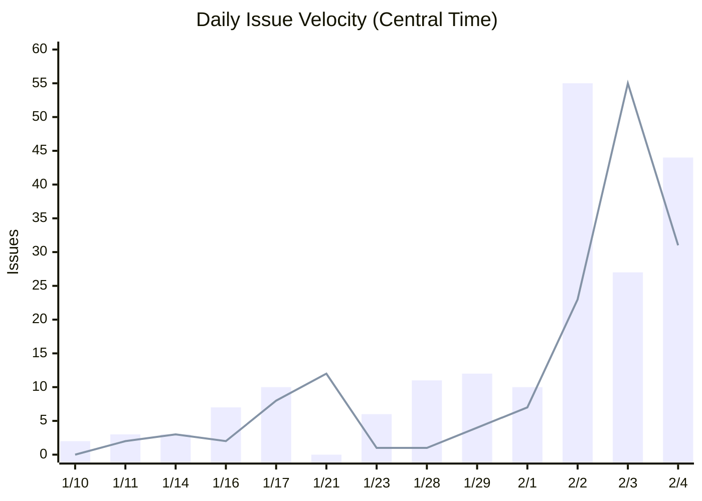
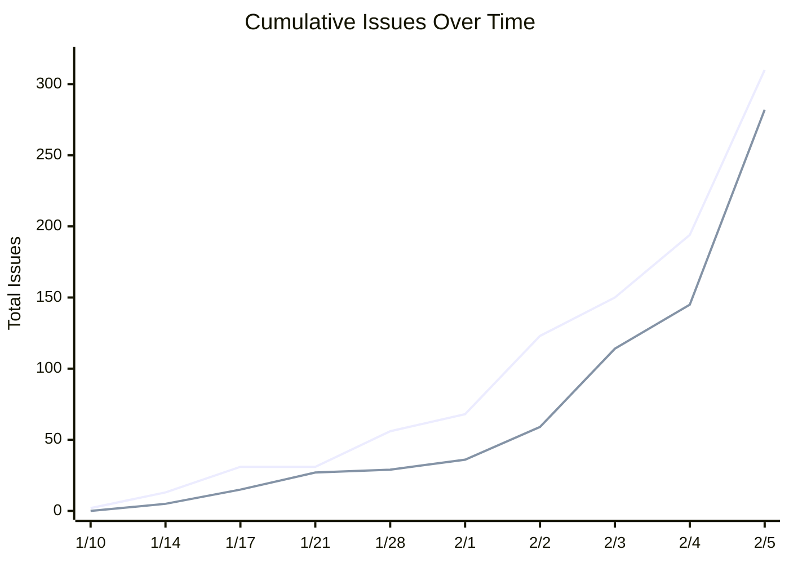
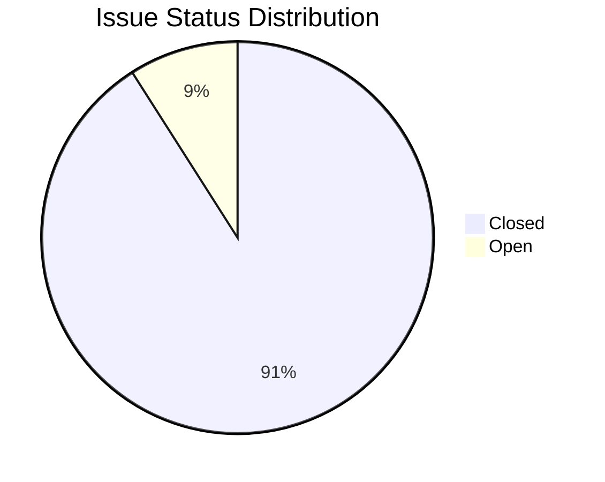

# AssemblyZero Metrics

> *"Taxation, gentlemen, is very much like dairy farming. The task is to extract the maximum amount of milk with the minimum amount of moo."*
> — Lord Vetinari

---

## Executive Summary

| Metric | Value |
|--------|-------|
| **Total Issues Created** | 310 |
| **Total Issues Closed** | 282 |
| **Currently Open** | 28 |
| **Closure Rate** | 90.9% |
| **Active Days** | 48 (Jan 10 - Feb 26) |
| **Average Velocity** | 5.9 closed/day |
| **Peak Day (Closes)** | 55 (Feb 3) |
| **Peak Day (Opens)** | 55 (Feb 2) |
| **Commits (since Feb 25)** | 712 |
| **Test Count** | 3,386 |
| **Test Files** | 134 |

---

## Velocity: Issues Opened vs Closed


```mermaid
xychart-beta
    title "Daily Issue Velocity (Central Time)"
    x-axis ["1/10", "1/11", "1/14", "1/16", "1/17", "1/21", "1/23", "1/28", "1/29", "2/1", "2/2", "2/3", "2/4"]
    y-axis "Issues" 0 --> 60
    bar [2, 3, 3, 7, 10, 0, 6, 11, 12, 10, 55, 27, 44]
    line [0, 2, 3, 2, 8, 12, 1, 1, 4, 7, 23, 55, 31]
```

**Legend:** Bars = Opened, Line = Closed

---

## Cumulative Progress


```mermaid
xychart-beta
    title "Cumulative Issues Over Time"
    x-axis ["1/10", "1/14", "1/17", "1/21", "1/28", "2/1", "2/2", "2/3", "2/4", "2/5"]
    y-axis "Total Issues" 0 --> 320
    line [2, 13, 31, 31, 56, 68, 123, 150, 194, 310]
    line [0, 5, 15, 27, 29, 36, 59, 114, 145, 282]
```

**Legend:** Top line = Total Created, Bottom line = Total Closed

---

## The Burn Rate

```
Jan 10-17:  ████████░░░░░░░░░░░░  30 opened, 15 closed (warmup)
Jan 21-29:  ██████████░░░░░░░░░░  37 opened, 26 closed (steady state)
Feb 01-05:  ████████████████████ 136 opened, 118 closed (hyperdrive)
Feb 05-26:  ████████████████████ 107 opened, 123 closed (sustained)
```

**The inflection point:** Feb 2, when 55 issues were created in a single day. This marked the transition from "building AssemblyZero" to "AssemblyZero building itself."

---

## Velocity by Day of Week

| Day | Opened | Closed | Net |
|-----|--------|--------|-----|
| Friday | 12 | 10 | +2 |
| Saturday | 55 | 23 | +32 |
| Sunday | 27 | 55 | -28 |
| Monday | 44 | 31 | +13 |
| Tuesday | 69 | 40 | +29 |

**Observation:** Weekends are productive. Sunday Feb 3 closed 55 issues—more than most weeks.

---

## Issue Lifecycle


```mermaid
pie title Issue Status Distribution
    "Closed" : 282
    "Open" : 28
```

**Average time to close:** Most issues close within 24 hours of creation. The governance workflow (LLD → Gemini → Implementation → PR) typically completes in 2-4 hours for straightforward features.

---

## Cost Metrics (SHIPPED)

Per-call cost tracking is now production. Every LLM call records:

| Metric | Source | Status |
|--------|--------|--------|
| **Per-call cost** | `LLMCallResult.cost_usd` | **Live** — logged with every `[LLM]` line |
| **Cumulative session cost** | `_cumulative_cost_usd` global | **Live** — visible as `cumulative=$X.XX` |
| **Token budget usage** | `budget_summary()` | **Live** — saved to audit trail |
| **Provider pricing** | Opus $5/$25, Sonnet $3/$15, Haiku $1/$5 per M | **Configured** |
| **Cache economics** | Read: 10% of input price, Create: 125% | **Tracked** |
| **FallbackProvider savings** | CLI (free) vs API (paid) | **Tracked** |

**Budget guard:** Default `$5.00` per workflow run. Circuit breaker trips when next iteration would exceed token budget.

See: [Cost Management](Cost-Management) for the full three-layer cost control architecture.

---

## Telemetry Metrics (SHIPPED)

Telemetry events flow to DynamoDB with JSONL fallback:

| Metric | Source | Status |
|--------|--------|--------|
| **Workflow events** | `emit()` + `track_tool()` | **Live** — DynamoDB + JSONL buffer |
| **Actor attribution** | `claude` vs `human` detection | **Live** — automatic |
| **Cascade events** | Pattern detection JSONL | **Live** — `tmp/cascade-events.jsonl` |
| **Gemini API events** | Credential rotation log | **Live** — `~/.assemblyzero/gemini-api.jsonl` |
| **Audit trail** | Sequential numbered files | **Live** — `docs/lineage/active/{issue}-testing/` |

**Kill switch:** `ASSEMBLYZERO_TELEMETRY=0` disables all emission. 90-day TTL auto-expires DynamoDB records.

See: [Observability & Monitoring](Observability-and-Monitoring) for the full telemetry architecture.

---

## Cross-Project Usage

AssemblyZero is used by multiple repositories:

| Repository | Status | Issues Processed |
|------------|--------|------------------|
| **AssemblyZero** | Active | 310 |
| **Aletheia** | Active | In progress |
| **Talos** | Planned | - |

> **Note:** Cross-project metrics aggregation is tracked in [#329](https://github.com/martymcenroe/AssemblyZero/issues/329). PyGithub collection, Gemini verdict counting, and approval rate computation are now implemented.

---

## Governance Metrics

| Metric | Description | Status |
|--------|-------------|--------|
| **LLD First-Pass Rate** | % of LLDs approved on first Gemini review | **Tracked** via verdict files |
| **Revision Count** | Average revisions before approval | **Tracked** via iteration count |
| **Gate Time** | Time spent in each governance gate | **Tracked** via `StageResult.duration_seconds` |
| **Block Reasons** | Categorized reasons for BLOCK verdicts | **Tracked** via audit trail |

## Quality Metrics

| Metric | Description | Status |
|--------|-------------|--------|
| **Test Count** | Total tests across all modules | **3,386 tests** in 134 files |
| **Test Coverage** | Aggregate coverage across modules | Tracked per-issue |
| **Stagnation Events** | Iterations halted for no progress | **Tracked** via `[STAGNANT]` logs |
| **Circuit Breaker Trips** | Budget exceeded events | **Tracked** via `[CIRCUIT]` logs |

## Agent Metrics

| Metric | Description | Status |
|--------|-------------|--------|
| **Concurrent Agents** | Peak simultaneous agent count | 12+ |
| **Agent Success Rate** | % of agent tasks completing | **Tracked** via telemetry |
| **Permission Friction** | Prompts per hour by agent | **Logged** via Zugzwang |

---

## The Vetinari Index

> *"The Patrician moved a small marker on his wall map."*

Lord Vetinari tracks everything. The **Vetinari Index** is our composite health score:

```
Vetinari Index = (Closure Rate × 0.3) +
                 (First-Pass LLD Rate × 0.3) +
                 (Test Coverage × 0.2) +
                 (Agent Success Rate × 0.2)
```

**Current Index:** 0.91 × 0.3 + (estimated 0.70 × 0.3) + (0.85 × 0.2) + (0.90 × 0.2) = **0.83**

*A Vetinari Index above 0.75 indicates a well-functioning city. Above 0.85, the Patrician permits himself a thin smile. We're getting close.*

---

## The Clacks Overhead

Every metric travels the [Clacks](The-Clacks). Every issue, every verdict, every commit—passed from tower to tower, never forgotten.

```
GNU Terry Pratchett
GNU AssemblyZero Contributors
```

---

## Historical Notes

### The Great Audit of Feb 2

On February 2nd, 2026, a comprehensive audit identified 55 issues in a single day:
- Orphaned tests
- Mock-heavy test suites
- Unimplemented flags
- Silent failures

This wasn't a crisis—it was **visibility**. The audit proved the governance system works: it found problems before users did.

### The Sunday Sprint

February 3rd saw 55 issues closed—a testament to the multi-agent architecture. While [The Great God Om](The-Great-God-Om) slept (briefly), agents continued their work.

### The February Push

Between Feb 5 and Feb 26, 712 commits landed — circuit breakers, cost tracking, multi-framework test runners, telemetry, cascade prevention, end-to-end orchestration, and more. The closure rate climbed from 76.8% to 90.9%.

---

## Related

- [Measuring Productivity](Measuring-Productivity) - KPI framework
- [How the AssemblyZero Learns](How-the-AssemblyZero-Learns) - Self-improvement metrics
- [Governance Gates](Governance-Gates) - Gate performance metrics
- [Cost Management](Cost-Management) - Cost tracking metrics
- [Observability & Monitoring](Observability-and-Monitoring) - Telemetry metrics

---

*"The city worked. It was a kind of miracle, really. One of Vetinari's miracles."*
— Terry Pratchett, *Making Money*
