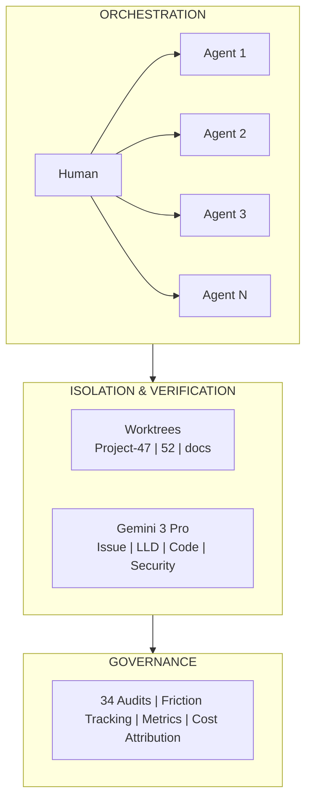
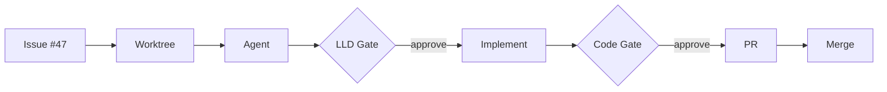
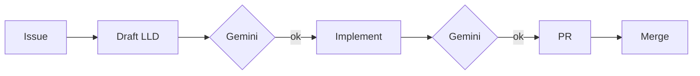
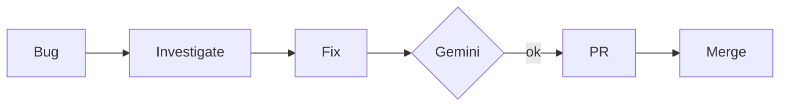
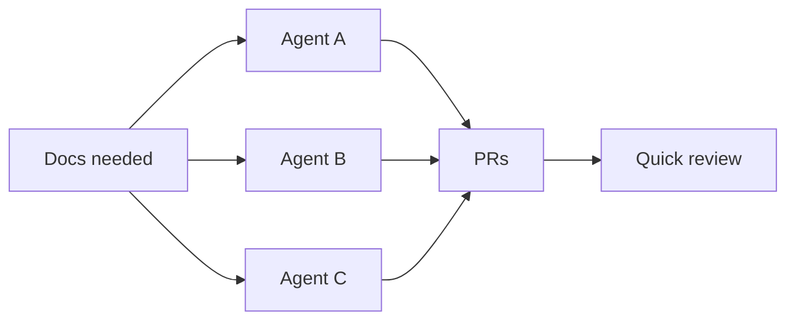

# Multi-Agent Orchestration

> The headline feature: Run 12+ AI agents concurrently under single-user identity with full coordination

---

## Why Multi-Agent?

Individual AI coding assistants are powerful. But real software development requires:

- **Parallel work** - Multiple features, bugs, and docs in flight simultaneously
- **Specialized agents** - Different tasks need different contexts and tools
- **Coordination** - Agents must not conflict or duplicate work
- **Human oversight** - One person orchestrating many agents

AssemblyZero enables this pattern at scale.

---

## Current Architecture



---

## Key Components

### 1. Single-User Identity Model

All agents operate under one user's identity and context:

| Aspect | How It Works |
|--------|--------------|
| **API Credentials** | Shared across agents with rotation |
| **Git Identity** | Same committer, different branches |
| **Permission Patterns** | Learned once, applied everywhere |
| **Context Files** | `CLAUDE.md` rules apply to all agents |

This means the human orchestrator maintains full control while agents parallelize the work.

### 2. Worktree Isolation

Every coding task gets its own git worktree:

```bash
# Agent 1 works on feature
git worktree add ../Project-47 -b 47-new-feature

# Agent 2 works on bug fix (in parallel)
git worktree add ../Project-52 -b 52-fix-crash

# Agent 3 updates docs (in parallel)
git worktree add ../Project-docs -b docs-update

# No conflicts. Each agent has full repo access.
# PRs merge cleanly when complete.
```

**Why worktrees?**
- Full repository access (not shallow clones)
- Complete git history for context
- Standard PR workflow when complete
- No merge conflicts between agents

### 3. Gemini Verification Layer

Claude agents build. Gemini reviews. This separation provides:

- **Adversarial verification** - Different model catches different mistakes
- **Enforced gates** - Can't skip to PR without review
- **Model verification** - Detects silent downgrades to lesser models
- **Credential rotation** - Auto-rotates when quota exhausted

See: [Gemini Verification](Gemini-Verification) for details.

### 4. Governance Gates

Three mandatory checkpoints:

| Gate | When | What |
|------|------|------|
| **LLD Review** | Before coding starts | Gemini reviews design document |
| **Implementation Review** | Before PR creation | Gemini reviews code changes |
| **Report Generation** | Before merge | Auto-generate implementation docs |

These gates are **enforced** through CLAUDE.md protocols, and will become **impossible to skip** with LangGraph state machines.

---

## Agent Roles

Different tasks benefit from different agent configurations:

| Role | Context | Typical Tasks |
|------|---------|---------------|
| **Feature Agent** | Full codebase context | New functionality, refactors |
| **Bug Fix Agent** | Issue-focused context | Specific bug investigation |
| **Documentation Agent** | Docs + code context | README, wiki, API docs |
| **Review Agent** | PR diff context | Code review assistance |
| **Explore Agent** | Search-optimized | Codebase exploration |
| **Audit Agent** | Compliance context | Security, privacy audits |

The orchestrator (human) assigns roles and routes results.

---

## Coordination Mechanisms

### Issue-Based Routing



### Conflict Prevention

| Mechanism | How |
|-----------|-----|
| **Worktree isolation** | Physical file separation |
| **Branch naming** | `{issue-id}-{description}` convention |
| **Lock files** | Optional mutex for shared resources |
| **Session logs** | Agents can check what others are doing |

### Status Visibility

The orchestrator sees all agent activity:
- Git worktree list shows active work
- Session transcripts show agent reasoning
- PR drafts show pending completions

---

## Scaling Characteristics

| Dimension | Current Limit | Bottleneck |
|-----------|---------------|------------|
| Concurrent agents | 12+ tested | Human attention |
| API rate limits | Rotated credentials | Anthropic quotas |
| Gemini reviews | Rotated credentials | Google quotas |
| Git worktrees | Unlimited | Disk space |

The practical limit is **human cognitive load** - one person can effectively orchestrate 3-5 complex tasks simultaneously, or 10-12 simple parallel tasks.

---

## Production Patterns

### Pattern 1: Feature Development



### Pattern 2: Bug Triage



### Pattern 3: Documentation Sprint



---

## Evolution: LangGraph Integration

The current prompt-based orchestration works but has limitations:
- Gates can theoretically be skipped
- No persistent state across sessions
- Human must remember agent assignments

The [LangGraph Evolution](LangGraph-Evolution) addresses these:
- State machines make gates **impossible to skip**
- Checkpointing survives session interruption
- Supervisor pattern enables autonomous task decomposition

---

## Related Pages

- [Gemini Verification](Gemini-Verification) - Multi-model review architecture
- [Governance Gates](Governance-Gates) - LLD, implementation, report gates
- [LangGraph Evolution](LangGraph-Evolution) - Enterprise state machines
- [Permission Friction](Permission-Friction) - Eliminating approval friction
