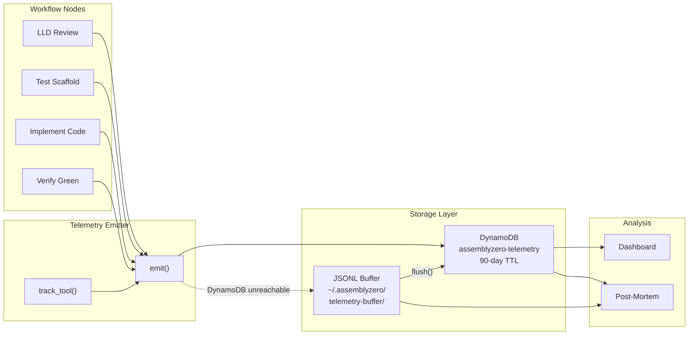
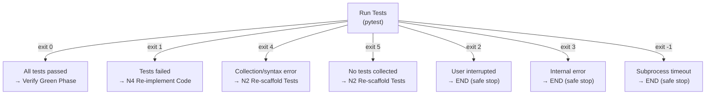

# Observability & Monitoring

> *"Knowledge is power. Power is energy. Energy is matter. Matter is mass. And mass distorts space."*
> — Lord Vetinari (paraphrased)

Lord Vetinari's wall map tracks every event in Ankh-Morpork. AssemblyZero's observability layer does the same for LLM-driven development — because non-deterministic systems demand more instrumentation, not less.

---

## Philosophy

Traditional APM assumes deterministic systems: the same input produces the same output, and deviations signal bugs. LLM systems break this assumption fundamentally. The same prompt can produce different code, different test strategies, different architectures. This means:

1. **Token-level accounting** — Every LLM call must be metered (input, output, cache, cost)
2. **Verdict tracking** — Every governance gate produces a verdict that feeds back into system tuning
3. **Stagnation detection** — "Still running" isn't the same as "making progress"
4. **Audit trails** — Every decision must be reconstructable for post-mortem analysis

---

## Telemetry Architecture



### Design Principles

| Principle | Implementation |
|-----------|---------------|
| **Fire-and-forget** | `emit()` never raises exceptions — telemetry failures don't break workflows |
| **Local fallback** | JSONL buffer at `~/.assemblyzero/telemetry-buffer/{YYYY-MM-DD}.jsonl` when DynamoDB is unreachable |
| **Kill switch** | `ASSEMBLYZERO_TELEMETRY=0` disables all emission instantly |
| **90-day TTL** | DynamoDB records auto-expire — no manual cleanup needed |
| **Actor detection** | Automatically distinguishes human vs Claude operations via environment inspection |

### Event Schema

Every telemetry event carries:

```
pk:          REPO#{repo}
sk:          EVENT#{timestamp}#{event_id}
gsi1pk:      ACTOR#{actor}          (claude | human)
gsi2pk:      USER#{github_user}
gsi3pk:      DATE#{date_str}
event_type:  workflow.start | tool.complete | ...
actor:        claude | human
repo:         AssemblyZero | Aletheia | ...
machine_id:   hashed(hostname + platform)
timestamp:    ISO8601
ttl:          epoch + 90 days
metadata:     { ... event-specific ... }
```

Three Global Secondary Indexes enable querying by actor, user, or date without table scans.

---

## Structured LLM Call Logging

Every LLM call — Claude, Gemini, Anthropic API — is logged with a structured line:

```
[LLM] provider=claude model=opus input=1024 output=512 cache_read=256 cache_create=128 cost=$0.0234 cumulative=$5.12 duration=2.3s
```

The `LLMCallResult` dataclass captures the full picture:

| Field | Type | Purpose |
|-------|------|---------|
| `input_tokens` | int | Prompt tokens consumed |
| `output_tokens` | int | Completion tokens generated |
| `cache_read_tokens` | int | Prompt cache hits (10% of input price) |
| `cache_creation_tokens` | int | Prompt cache writes (125% of input price) |
| `cost_usd` | float | Actual cost from API response |
| `rate_limited` | bool | True if 429 was encountered |
| `credential_used` | str | Which credential (for rotation tracking) |
| `rotation_occurred` | bool | True if credential rotation happened mid-call |

A global `_cumulative_cost_usd` counter accumulates across the session, visible in every log line as `cumulative=$X.XX`.

---

## Workflow Audit Trails

Every workflow execution writes to two audit systems:

### 1. Central Audit Log

`docs/lineage/workflow-audit.jsonl` — a single append-only JSONL file recording every workflow event:

```json
{
  "timestamp": "2026-02-26T15:30:00Z",
  "workflow_type": "testing",
  "issue_number": 477,
  "target_repo": "/c/Users/mcwiz/Projects/Aletheia",
  "event": "complete",
  "details": {"passed": 25, "failed": 0, "coverage": 95.2, "iterations": 3}
}
```

### 2. Per-Issue Lineage Directory

`docs/lineage/active/{issue}-testing/` — sequential numbered files capturing every artifact:

```
001-lld.md                    # Full LLD content
002-test-plan.md             # Extracted test plan (Section 10)
003-review-prompt.md         # Gemini review prompt
004-verdict.md               # Gemini verdict (APPROVE/BLOCK)
005-test-scaffold.py         # Generated test file (iteration 1)
...
015-prompt-tests-*.md        # Claude implementation prompt
016-response-tests-*.md      # Claude implementation response
...
089-final-report.md          # Final test report
```

The `next_file_number()` function scans for the `NNN-*.*` pattern and auto-increments sequentially. Every decision, every prompt, every response — captured and numbered.

---

## Exit Code Routing

Pytest exit codes aren't just pass/fail — they carry diagnostic meaning that drives workflow routing:



| Exit Code | Meaning | Workflow Action |
|-----------|---------|-----------------|
| **0** | All tests passed | Proceed to verify green phase |
| **1** | Some tests failed | Re-implement code (N4) |
| **2** | User interrupted | Safe stop — human review needed |
| **3** | Internal pytest error | Safe stop — infrastructure issue |
| **4** | Usage/syntax error | Re-scaffold tests (N2) — generation problem |
| **5** | No tests collected | Re-scaffold tests (N2) — empty test file |
| **-1** | Subprocess timeout | Safe stop — runaway test |

The critical distinction: exit codes 4/5 indicate the *test generation* failed (go back to scaffolding), while exit code 1 indicates the *implementation* is wrong (go back to coding). This prevents the common failure mode of endlessly re-implementing code when the tests themselves are broken.

---

## Stagnation Detection

The most expensive failure mode in LLM-driven development is the infinite loop: the model keeps trying, tokens keep burning, but nothing improves. Stagnation detection catches this.

### Two Signals

**1. Test Count Stagnation**
```
If passed_count == previous_passed:
    → HALT: "Same number of tests passing — no progress"
```

**2. Coverage Stagnation**
```
If coverage_achieved <= previous_coverage + 1.0%:
    → HALT: "Coverage improved by <1% — insufficient progress"
```

Both are checked in the verify-green-phase node (N5). The workflow tracks `previous_passed` and `previous_coverage` across iterations, and if two consecutive iterations show no meaningful improvement, the circuit trips with a `[STAGNANT]` message.

This implements the **Two-Strike Rule**: same approach fails twice → stop and diagnose. Don't burn tokens on a third attempt.

---

## Implement Status File

Every implementation run produces `.implement-status-{issue}.json` — a discoverable success/failure indicator with full state:

```json
{
  "issue": 100,
  "status": "SUCCESS",
  "timestamp": "2026-02-26T15:30:00Z",
  "repo": "/c/Users/mcwiz/Projects/Aletheia",
  "iterations": 3,
  "max_iterations": 5,
  "coverage_achieved": 95.2,
  "coverage_target": 95,
  "test_files": ["tests/unit/test_foo.py"],
  "implementation_files": ["src/foo.py", "src/bar.py"],
  "tokens_used": 45000,
  "token_budget": 200000,
  "events": [
    {"time": "2026-02-26T15:25:00Z", "event": "start", "details": {"scenario_count": 25}},
    {"time": "2026-02-26T15:26:00Z", "event": "test_plan_reviewed", "details": {"status": "APPROVED"}},
    {"time": "2026-02-26T15:30:00Z", "event": "complete", "details": {"passed": 25, "failed": 0}}
  ]
}
```

The event timeline provides a post-mortem trail — when did each phase start, what was reviewed, what passed.

---

## Cross-Project Metrics

AssemblyZero tracks metrics across all repositories it manages:

| Metric | Source | Method |
|--------|--------|--------|
| Issues created/closed | GitHub API | PyGithub per-repo collection |
| Workflows used | Issue labels | `workflow:` prefix scanning + heuristic fallback |
| LLDs generated | File system | `docs/lld/active/` and `docs/lld/done/` scanning |
| Gemini reviews | Report files | `docs/reports/*/gemini-*.md` verdict parsing |
| Gemini approval rate | Computed | `approvals / total_reviews` |

Results are cached (30-minute TTL) to avoid repeated GitHub API calls, and aggregated across repos into a unified `AggregatedMetrics` snapshot.

---

## Related

- [Cost Management](Cost-Management) — Token budgets and circuit breakers
- [Safety & Guardrails](Safety-and-Guardrails) — Kill switches and cascade prevention
- [Metrics Dashboard](Metrics) — Production numbers
- [End-to-End Orchestration](End-to-End-Orchestration) — Pipeline that generates these signals

---

*Lord Vetinari moved a small marker on his wall map. The city continued to function. That was, after all, the point.*

**GNU Terry Pratchett**
