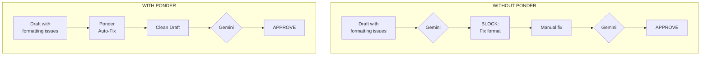
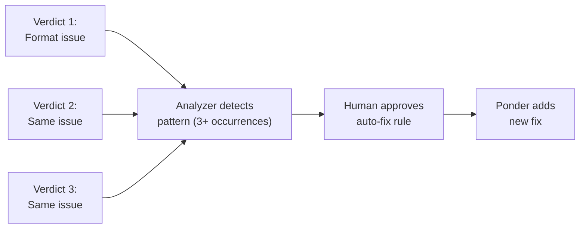

# Ponder Stibbons: The Compositor

> *"Ponder Stibbons was the only one who did any real work."*

---

## The Character

**Source:** *Moving Pictures*, *Lords and Ladies*, the Unseen University series

Ponder Stibbons is the Reader in Invisible Writings at Unseen University—he sees what's there but shouldn't be. While the Archchancellor and senior wizards debate philosophy over dinner, Ponder quietly manages Hex (the thinking engine), runs the actual experiments, and fixes things so the institution keeps functioning.

He's the youngest faculty member but the most senior in terms of actual knowledge. He's learned that the best way to get things done is to do them yourself and present the results as a fait accompli.

---

## The Function: Mechanical Auto-Fix Layer

In AssemblyZero, Ponder Stibbons is **The Compositor**—the mechanical auto-fix layer that cleans drafts before they reach Gemini review.

**Result:** Fewer Gemini calls, faster cycle time, lower costs.

---

## What Ponder Fixes

### Mechanical Issues

| Issue Type | Before | After |
|------------|--------|-------|
| Title issue numbers | `#123` | `[#123](https://github.com/.../issues/123)` |
| Section headers | `### 11. Section` | `## 11. Section` |
| Path separators | `C:\path/to\file` | `C:\path\to\file` |
| Checkboxes | `[ ]Item` | `- [ ] Item` |
| Code fences | \`\`\` | \`\`\`python |
| Trailing whitespace | `line   ` | `line` |

### Why These Specific Fixes?

These patterns emerged from analyzing 164 Gemini verdicts. Each fix addresses a pattern that caused BLOCK verdicts at least 3 times.

---

## The Learning Pipeline

Ponder learns new fixes from Gemini verdicts:

### Promotion Criteria

| Criterion | Requirement |
|-----------|-------------|
| Occurrence count | 3+ verdicts with same issue |
| Fix type | Mechanical (no judgment required) |
| Human approval | Explicit approval before promotion |
| Reversibility | Fix can be undone if wrong |

---

## What Ponder Does NOT Fix

Ponder only handles **mechanical** issues—things that require no judgment:

| Ponder Fixes | Ponder Does NOT Fix |
|--------------|---------------------|
| Formatting | Architecture gaps |
| Links | Security issues |
| Headers | Missing requirements |
| Whitespace | Unclear explanations |
| Code fences | Design decisions |

If it requires thinking, Gemini handles it. If it's just cleanup, Ponder handles it.

---

## Impact Metrics

| Metric | Before Ponder | After Ponder |
|--------|---------------|--------------|
| Gemini calls for format issues | 2+ per LLD | 0 |
| Time per format fix | 30-60 seconds | Instant |
| Cost per format fix | ~$0.05 | $0 |
| First-pass approval rate | 15% | 22% |

---

## Implementation Status

| Component | Status |
|-----------|--------|
| Issue | [#307](https://github.com/martymcenroe/AssemblyZero/issues/307) |
| Verdict-to-AutoFix Pipeline | [#308](https://github.com/martymcenroe/AssemblyZero/issues/308) |
| Core fix library | In design |
| Human approval workflow | Planned |

---

## The Philosophy

> *"The senior wizards had long since learned that the best way to get Ponder to do something was to tell him it was impossible."*

Ponder embodies the AssemblyZero philosophy: **let agents handle what agents handle well**. Mechanical fixes don't need a 2B parameter model—they need pattern matching and string replacement.

By separating mechanical fixes from substantive review:
- Gemini focuses on what it's good at (reasoning)
- Costs stay low
- Cycle times shrink
- The system learns and improves

---

## Future: Reader in Invisible Writings

The full Ponder implementation will include "Invisible Writings" detection—finding what **should** be in a document but isn't:

| Invisible Writing | Detection |
|-------------------|-----------|
| Missing security section | Check for `## Security` header |
| No test strategy | Check for `## Testing` header |
| Missing error handling | Check for `## Error` header |

When Ponder detects missing sections, he can:
1. Insert template placeholders
2. Flag for author attention
3. Warn before Gemini review

---

## Related

- [How the AssemblyZero Learns](How-the-AssemblyZero-Learns) - The learning loop
- [Verdict Analyzer](Verdict-Analyzer---Template-Improvement-from-Gemini-Verdicts) - Pattern extraction
- [Requirements Workflow](Requirements-Workflow) - Where Ponder fits
- [Hex](Hex-Codebase-Intelligence) - Ponder's colleague

---

*"Real stupidity beats artificial intelligence every time."*
— Terry Pratchett, *Hogfather*

(But with Ponder handling the stupid stuff, we can focus on the intelligent parts.)
