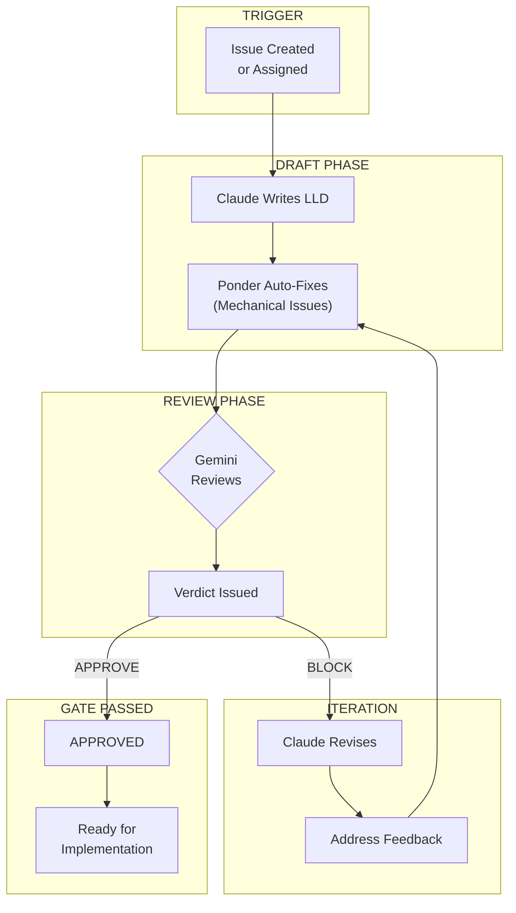

# Requirements Workflow

> *"Measure twice, cut once. In software: design twice, code once."*

The Requirements Workflow ensures every significant change has a reviewed design before implementation begins.

---

## Overview



---

## Why Review Designs First?

| Stage | Cost to Fix |
|-------|-------------|
| Design (LLD) | 1 hour |
| Implementation | 8 hours |
| Production | 80 hours |

By catching issues in the LLD phase, we avoid expensive rework downstream.

---

## The Lineage System

Every LLD goes through a documented **lineage** - a complete audit trail of drafts and verdicts:

```
docs/lineage/active/{issue}-lld/
├── 001-issue.md      # Original issue text
├── 002-draft.md      # First LLD draft
├── 003-verdict.md    # Gemini's first review
├── 004-draft.md      # Revised LLD
├── 005-verdict.md    # Gemini's second review
├── 006-final.md      # APPROVED version
└── 007-approved.json # Machine-readable approval
```

### Why Lineage Matters

1. **Audit Trail**: Every decision is documented
2. **Learning**: Verdicts feed into template improvements
3. **Debugging**: Can trace why a design evolved
4. **Compliance**: Full history for security reviews

---

## LLD Structure

The Low-Level Design document follows a standard template:

```markdown
# LLD: {Issue Title}

## 1. Context & Problem Statement
What we're solving and why

## 2. Requirements
### 2.1 Functional Requirements
### 2.2 Non-Functional Requirements

## 3. Technical Approach
### 3.1 Solution Overview
### 3.2 Architecture Decisions
### 3.3 Data Model (if applicable)
### 3.4 API Contract (if applicable)

## 4. Implementation Plan
### 4.1 Files to Create/Modify
### 4.2 Dependencies
### 4.3 Migration (if applicable)

## 5. Testing Strategy
### 5.1 Unit Tests
### 5.2 Integration Tests

## 6. Error Handling
### 6.1 Failure Modes
### 6.2 Recovery Strategy

## 7. Security Considerations
### 7.1 Authentication/Authorization
### 7.2 Data Protection

## 8. Observability
### 8.1 Logging
### 8.2 Metrics

## 9. Rollout Plan
### 9.1 Feature Flags
### 9.2 Rollback Strategy
```

---

## Gemini Review Criteria

Gemini evaluates LLDs against these criteria:

| Category | Questions |
|----------|-----------|
| **Completeness** | All requirements addressed? Edge cases considered? |
| **Architecture** | Fits existing patterns? Dependencies clear? |
| **Security** | Auth/authz covered? Data protection addressed? |
| **Error Handling** | Failure modes identified? Recovery clear? |
| **Testability** | Testing strategy realistic? Coverage adequate? |
| **Cost** | API costs considered? Resource usage bounded? |

### Verdict Format

```json
{
  "verdict": "APPROVE" | "BLOCK",
  "tier1_blocking": [
    {
      "category": "security",
      "issue": "No input validation on user paths",
      "recommendation": "Add path validation in section 3.2"
    }
  ],
  "tier2_improvements": [
    {
      "category": "quality",
      "issue": "Consider logging strategy",
      "recommendation": "Add section 8.1"
    }
  ]
}
```

---

## Ponder Stibbons: The Compositor

Before LLDs reach Gemini, [Ponder Stibbons](Ponder-Stibbons) performs mechanical fixes:

| Fix Type | Example |
|----------|---------|
| Title issue numbers | `#123` → `[#123](link)` |
| Section header format | `### 11.` → `## 11.` |
| Path format normalization | Mixed slashes → consistent |
| Checkbox standardization | `[ ]` formatting |
| Code fence validation | Language tags present |

This reduces Gemini blocks for trivial formatting issues, saving time and API costs.

---

## Approval Rates

Based on 164 verdicts analyzed:

| Outcome | Rate |
|---------|------|
| First-pass APPROVE | 22% |
| After 1 revision | 65% |
| After 2 revisions | 90% |
| After 3+ revisions | 99% |

**The 22% first-pass rate is improving** as the [self-improvement loop](How-the-AssemblyZero-Learns) adds sections to templates based on common block reasons.

---

## Common Block Reasons

| Category | Frequency | Now in Template |
|----------|-----------|-----------------|
| Architecture decisions | 23 | Yes (Section 3.2) |
| Quality/completeness | 23 | Yes (enhanced) |
| Security considerations | 10 | Yes (Section 7) |
| Safety considerations | 9 | Yes (Section 7.2) |
| Legal/compliance | 8 | Yes (Section 9) |
| Cost analysis | 6 | Yes (Section 8.2) |

---

## Human Override

For hotfixes or urgent issues, the human orchestrator ([The Great God Om](The-Great-God-Om)) can waive the LLD requirement:

```
User: "This is a critical hotfix, waive LLD review"
Claude: "Acknowledged. Waiving LLD review for HOTFIX. Proceeding to implementation."
```

The waiver is logged in the lineage for audit purposes.

---

## Integration Points

| System | How It Connects |
|--------|-----------------|
| **GitHub Issues** | Issue triggers workflow start |
| **Gemini API** | Reviews LLD drafts |
| **Lineage System** | Stores all drafts and verdicts |
| **Verdict Analyzer** | Extracts patterns for learning |
| **Implementation Workflow** | Receives APPROVED LLDs |

---

## Related

- [Implementation Workflow](Implementation-Workflow) - What happens after LLD approval
- [Governance Gates](Governance-Gates) - All gates explained
- [How the AssemblyZero Learns](How-the-AssemblyZero-Learns) - Template improvement from verdicts
- [Ponder Stibbons](Ponder-Stibbons) - Mechanical auto-fix layer

---

*"The Senior Wrangler never made a decision that he hadn't worried about for at least a week."*
— Terry Pratchett, *The Last Continent*
