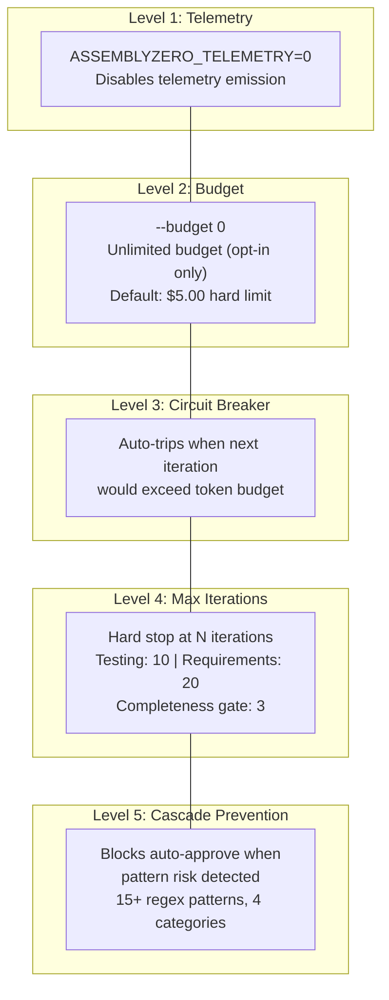
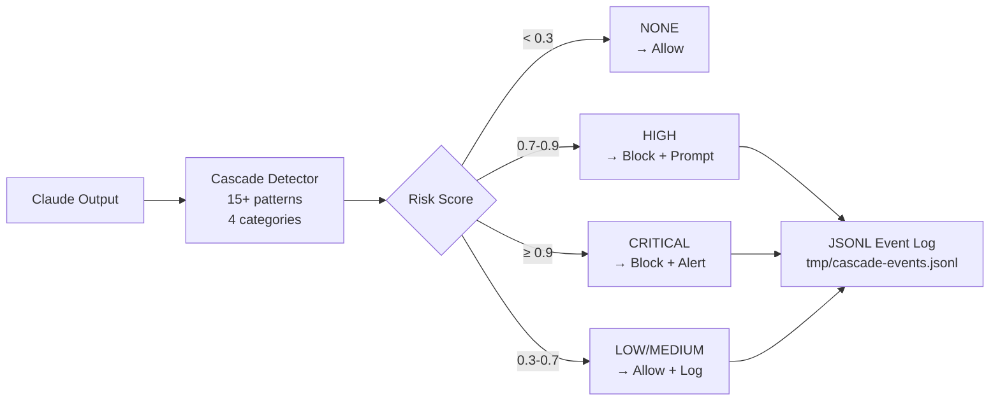
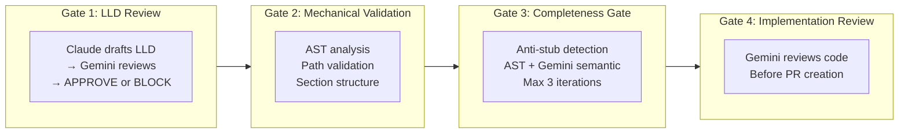
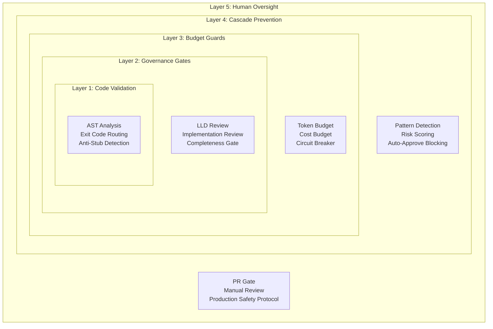

# Safety & Guardrails

> *"Vimes had once discussed the Clacks semaphore system with its inventor. 'The problem,' he'd said, 'is not making it go. The problem is making it stop.'"*
> — Commander Vimes (approximately)

Commander Vimes' deep suspicion — trust nothing, verify mechanically — is the design philosophy behind every safety system in AssemblyZero. An AI that can write code autonomously *must* have mechanical constraints, not just polite suggestions.

---

## Kill Switches (5 Levels)

AssemblyZero provides five levels of kill switches, from surgical to total:



| Level | Mechanism | Default State | Override |
|-------|-----------|---------------|---------|
| 1. Telemetry kill | `ASSEMBLYZERO_TELEMETRY=0` | Enabled (1) | Env var |
| 2. Budget limit | `--budget` CLI flag | $5.00 USD | `--budget 0` for unlimited |
| 3. Circuit breaker | Token cost estimation | Active when budget > 0 | Cannot be disabled |
| 4. Max iterations | Hard iteration cap | 10 (testing), 20 (requirements) | CLI flag |
| 5. Cascade prevention | Pattern-based detection | Active in auto-approve mode | Config override |

---

## Cascade Prevention System

When running with auto-approve enabled, AssemblyZero monitors the model's output for patterns that indicate cascading task execution — where the AI tries to autonomously start new work without human direction.

### Detection Architecture



### Pattern Categories

| Category | What It Catches | Example Patterns |
|----------|----------------|------------------|
| **Continuation Offer** | "Should I continue with..." | Numbered yes/no options, "proceed to next" |
| **Numbered Choice** | "1. Do X  2. Do Y" | Auto-generated option menus |
| **Task Completion Pivot** | "Now let me also..." | Scope expansion after completing a task |
| **Scope Expansion** | "While I'm at it..." | Unprompted additional work |

### Risk Levels

| Level | Score Range | Action |
|-------|------------|--------|
| **NONE** | < 0.3 | Allow — no risk detected |
| **LOW** | 0.3 - 0.5 | Allow + log to JSONL |
| **MEDIUM** | 0.5 - 0.7 | Allow + log to JSONL |
| **HIGH** | 0.7 - 0.9 | **Block** auto-approve + prompt human |
| **CRITICAL** | ≥ 0.9 | **Block** auto-approve + alert |

### Integration

The cascade detector runs as a Claude Code `PostToolUse` hook:
- Reads model output from stdin (JSON format)
- Returns exit code 0 (allow) or 2 (block)
- **Fail-open**: if the hook itself crashes, Claude Code continues normally
- All events logged to `tmp/cascade-events.jsonl` with timestamp, risk level, matched patterns, and action taken

---

## Rollback Mechanisms

### Worktree Isolation

Every coding task gets its own git worktree:

```
main branch (clean)
├── ../AssemblyZero-477/    ← worktree for issue #477
├── ../AssemblyZero-478/    ← worktree for issue #478
└── (no cross-contamination)
```

If anything goes wrong: `git worktree remove ../AssemblyZero-477` — instant, clean rollback. No messy reverts, no stash conflicts.

### State Persistence

The orchestrator saves state after every stage to `.assemblyzero/orchestrator/state/{issue_number}.json`:

```json
{
  "issue_number": 477,
  "current_stage": "impl",
  "stage_results": {
    "triage": {"status": "passed", "duration_seconds": 45},
    "lld": {"status": "passed", "duration_seconds": 120},
    "spec": {"status": "passed", "duration_seconds": 90}
  },
  "started_at": "2026-02-26T15:00:00Z"
}
```

Use `--resume-from impl` to restart from the implementation stage without re-running triage, LLD, and spec.

### File-Based Locking

Prevents concurrent orchestrator runs on the same issue:

```
.assemblyzero/orchestrator/locks/477.lock
{
  "pid": 12345,
  "started_at": "2026-02-26T15:00:00Z",
  "hostname": "WORKSTATION"
}
```

- **Stale lock detection**: `os.kill(pid, 0)` checks if the process is still alive
- **Automatic cleanup**: dead process locks are removed automatically
- **Clear error**: "Issue 477 is already being orchestrated. Check .../477.lock"

### Lineage Archival

On completion, all artifacts move from `active/` to `done/`:

```
docs/lineage/active/477-testing/  →  docs/lineage/done/477-testing/
```

The `done/` directory is historical record — immutable once archived. The `active/` directory is working state — mutable during the workflow.

---

## Governance Gates (Enforced, Not Suggested)

These gates are mechanical — they run automatically and block progression. They're not "best practices" that developers might skip.



| Gate | What It Checks | Hard Limit |
|------|---------------|------------|
| **LLD Review** | Design quality, completeness, feasibility | Gemini must APPROVE before coding starts |
| **Mechanical Validation** | LLD paths exist, sections present, syntax valid | Blocks on structural errors |
| **Test Plan Validation** | Coverage, assertion clarity, human-delegation markers | Blocks incomplete plans |
| **Completeness Gate** | Anti-stub detection via AST + Gemini semantic review | Max 3 BLOCK iterations, then END |
| **Implementation Review** | Code quality, test coverage, security | Gemini must APPROVE before PR |

### Anti-Stub Detection

The completeness gate uses AST analysis to detect incomplete implementations:

| Detection | What It Finds |
|-----------|--------------|
| `NotImplementedError` | Unimplemented methods |
| `pass` statements | Empty function bodies |
| Trivial returns | `return None`, `return 0`, `return ""` |
| Dead code markers | `# TODO`, `# FIXME`, `# HACK` |

If AST analysis fails (parse error), the gate proceeds with a WARN verdict — fail-open for non-critical analysis, fail-closed for critical gates.

---

## Multi-Model Adversarial Verification

Claude builds. Gemini reviews. Different model families catch different mistakes.

| Phase | Builder | Reviewer | Why Different Families |
|-------|---------|----------|----------------------|
| LLD Design | Claude | Gemini | Different training data, different blind spots |
| Code Implementation | Claude | Claude (self-test) | TDD provides mechanical verification |
| Code Review | — | Gemini | Independent second opinion |
| Test Completeness | — | Gemini | Semantic review catches what AST misses |

### Model Verification

The system confirms the actual model matches the requested model:

- **Gemini**: `model_verified` field in `GeminiCallResult` confirms the response came from the requested model
- **Forbidden models**: Flash and Lite models are rejected for reviews (fail-closed). Only Pro-tier models are permitted
- **Fallback chain**: `gemini-3-pro-preview` only (never downgrades to Flash)

---

## Responsible AI Practices

### Two-Strike Rule

If the same approach fails twice, **stop**. Don't retry a third time.

```
Iteration 1: 3/25 tests passing
Iteration 2: 3/25 tests passing  ← Strike 2: same result
→ HALT. Diagnose, don't retry.
```

This applies to everything: workflow runs, API calls, test executions. Zero progress across 2 iterations = broken, not flaky.

### Credential Rotation Without Shortcuts

When Gemini quota is exhausted on one credential, the system rotates to the next (max 3 retries per credential). But it **never skips review** — if all credentials are exhausted, the workflow halts rather than proceeding without governance.

### Production Safety Protocol

Every production configuration change requires:

1. **Tracking issue** — a GitHub issue documenting the change
2. **Blast radius assessment** — what breaks if the change is wrong
3. **Rollback plan** — exact revert commands prepared in advance
4. **Post-change verification** — curl/test confirming the change works

### Historical Intelligence

History Monks check "have we solved this before?" — searching closed issues and archived lineage for similar problems. This prevents re-inventing solutions and ensures institutional knowledge persists across sessions.

---

## Safety Layers (Inside Out)



The innermost layer (code validation) is fastest and cheapest. Each outer layer adds more context and more cost. The outermost layer (human oversight) is the final backstop — always available, never automated away.

---

## Hallucination Prevention

The core insight: **you can't reliably detect hallucinations in generated text, but you can detect hallucinations in generated code** — because code can be executed.

### Execution-Based Verification

Generated code is actually *run*, not just reviewed:
- If the model hallucinates an import that doesn't exist, **pytest exit code 4** (collection error) catches it and routes back to re-scaffold
- If the model claims it implemented a feature but the test fails, **exit code 1** routes back to re-implement
- If tests hang from hallucinated infinite loops, the **subprocess timeout** (-1) catches it

### Structural Verification

AST analysis detects "code that looks right but does nothing":
- `NotImplementedError` — unimplemented method stubs
- `pass` statements — empty function bodies
- Trivial returns (`return None`, `return 0`) — placeholder implementations
- File path validation — the model can only write to paths declared in the LLD. Phantom file references are blocked

### Context Grounding

Every mechanism forces the model to work from facts, not imagination:
- **LLD injection** — the full design document is injected into every TDD iteration, anchoring the model to the design
- **Test output feedback** — the actual pytest output from the previous iteration is fed back, forcing the model to address real failures rather than imagined ones
- **Accumulated context** — completed implementation files from prior iterations are carried forward, so the model sees what it already built

### Adversarial Cross-Model Verification

A different model family (Gemini) reviews Claude's work. Cross-model review catches confident-sounding but wrong solutions that self-review would miss. Different training data means different blind spots — what one hallucinates, the other questions.

### Mechanical Limits

- **Max iteration caps** prevent the model from endlessly "trying harder" at a wrong approach
- **Stagnation detection** halts when pass count or coverage doesn't improve — the model isn't "almost there," it's stuck
- **Two-Strike Rule** — same approach, same result, twice → stop. Don't burn tokens on a third attempt

---

## Related

- [Observability & Monitoring](Observability-and-Monitoring) — Telemetry and audit trails
- [Cost Management](Cost-Management) — Budget guards and circuit breakers
- [End-to-End Orchestration](End-to-End-Orchestration) — Pipeline that enforces these gates
- [Governance Gates](Governance-Gates) — Detailed gate documentation

---

*Commander Vimes trusted nothing. Not because he was cynical, but because he'd seen what happened when people assumed things were fine. The city ran on suspicion, and it ran well.*

**GNU Terry Pratchett**
