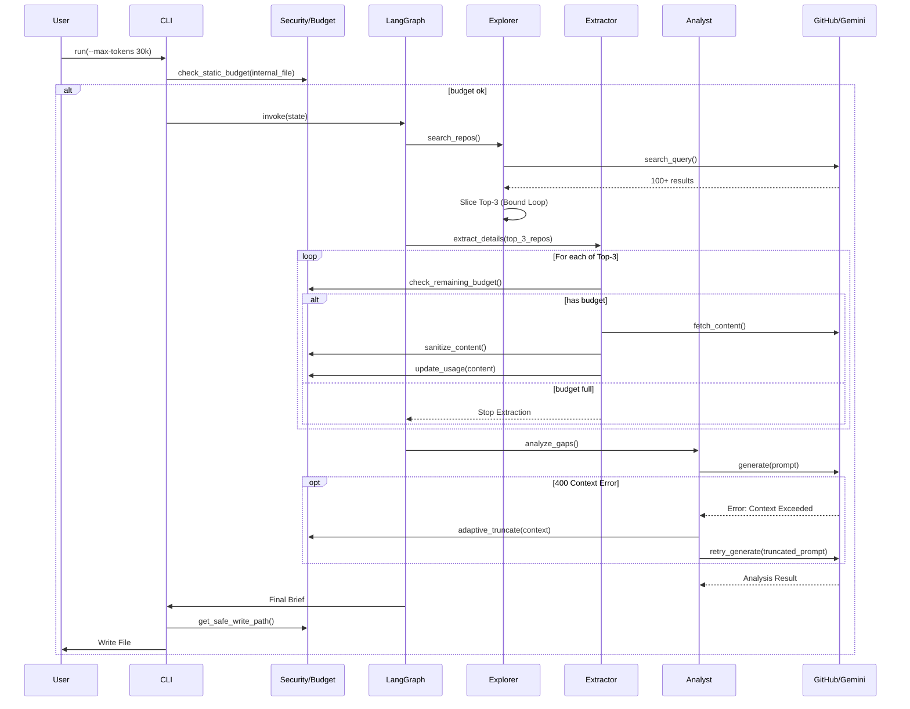

# The Scout: External Intelligence Gathering Workflow

> Generated from [Issue #93](../issues/93)

---

## Overview

* **Issue:** #93
* **Objective:** Create a proactive research workflow that searches GitHub for best practices, analyzes top implementations, compares them against internal code, and produces an "Innovation Brief" to identify gaps.
* **Status:** Approved (gemini-3-pro-preview, 2026-01-31)
* **Related Issues:** None - Foundational Feature.

### Open Questions
* **Tokenizer Mismatch Risk:** `tiktoken` (OpenAI) is used for estimation, but Gemini (Google) is the execution model. Vocabulary differences can lead to underestimation and API failures.
    * *Decision:* Implement a **"Pessimistic Estimation + Adaptive Fallback"** strategy. We apply a 1.2x safety buffer to `tiktoken` counts. Crucially, we wrap the LLM invocation in a retry handler that catches `400 INVALID_ARGUMENT` (Context Length Exceeded), truncates the external context by 50%, and retries once automatically.
* **Search Bounding:** How do we prevent the workflow from processing too many repositories or incurring runaway API costs?
    * *Decision:* Implement a hard **Top-N Limit** (default 3) in the `Explorer` node *immediately* after the metadata search. The extraction node will never receive more than 3 targets, ensuring the heavy "fetch content" API calls are strictly bounded.

---

## Architecture

---

## Key Features

- **PyGithub**: For GitHub Search and Content API interactions.
- **tiktoken**: For local, offline token estimation.
- **google-generativeai**: Existing dependency for LLM interactions.
- **langgraph**: Existing dependency for workflow orchestration.
- **langsmith**: For optional trace observability.
- **tenacity**: For robust retry logic on API calls.
- Optional
- **Module Location:** `assemblyzero/workflows/scout/`
- **Design Pattern:** Chain of Responsibility (LangGraph).
- **Budget Bound:** `Extractor` node checks `budget.check_and_update_budget` inside its loop.

---

## Related

- [Issue #93](../issues/93)
- [LLD](../docs/lld/active/LLD-093.md)
