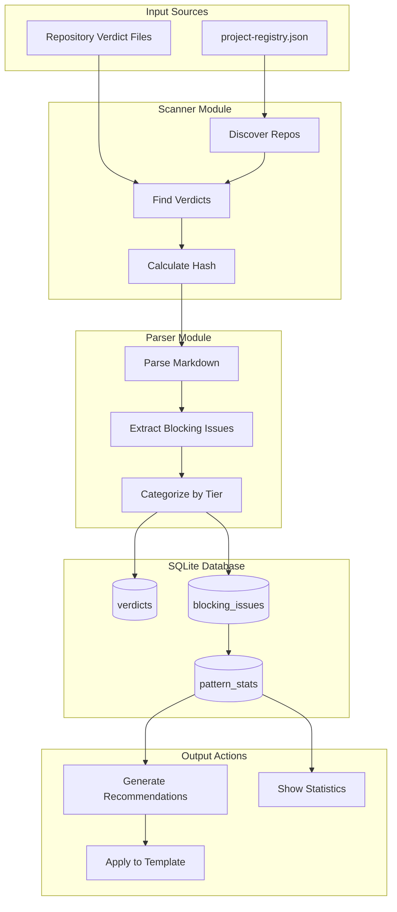

# Verdict Analyzer - Template Improvement from Gemini Verdicts

> Generated from [Issue #104](../issues/104)

---

## Overview

* **Issue:** #105
* **Objective:** Create a Python CLI tool that analyzes Gemini governance verdicts across repositories, extracts blocking patterns, and automatically improves LLD/issue templates.
* **Status:** Draft
* **Related Issues:** #94 (Janitor integration), #77 (Issue template)

---

## Architecture

---

## Key Features

- for implementation. Describe exactly what will be built.*
- **Module:** `tools/verdict_analyzer/`
- **Pattern:** CLI with subcommand-style flags, SQLite for persistence, safe file operations
- Database stored in project-local `.assemblyzero/` directory (worktree-scoped)

---

## Related

- [Issue #104](../issues/104)
- [LLD](../docs/lld/active/LLD-104.md)
